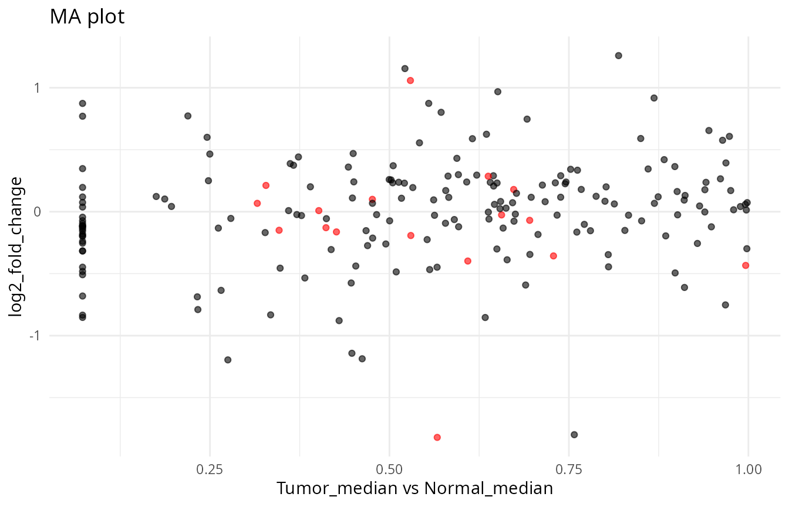
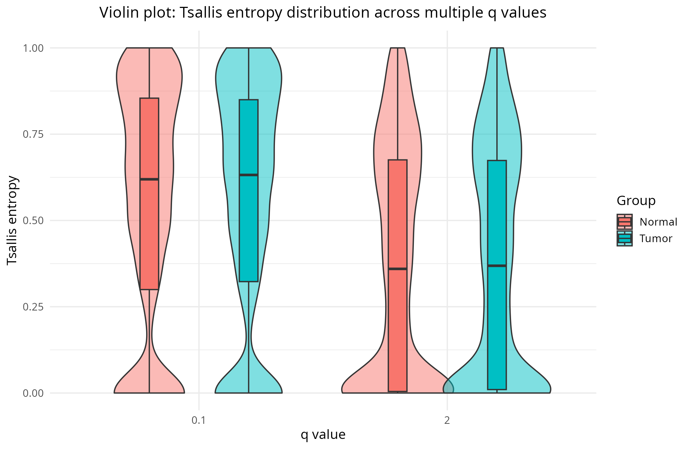
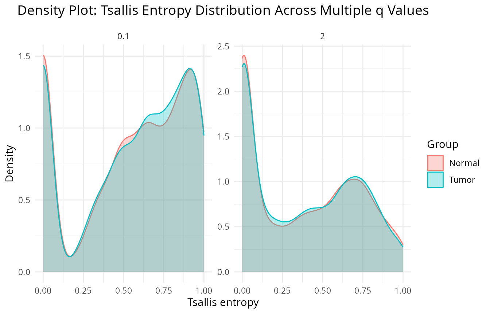
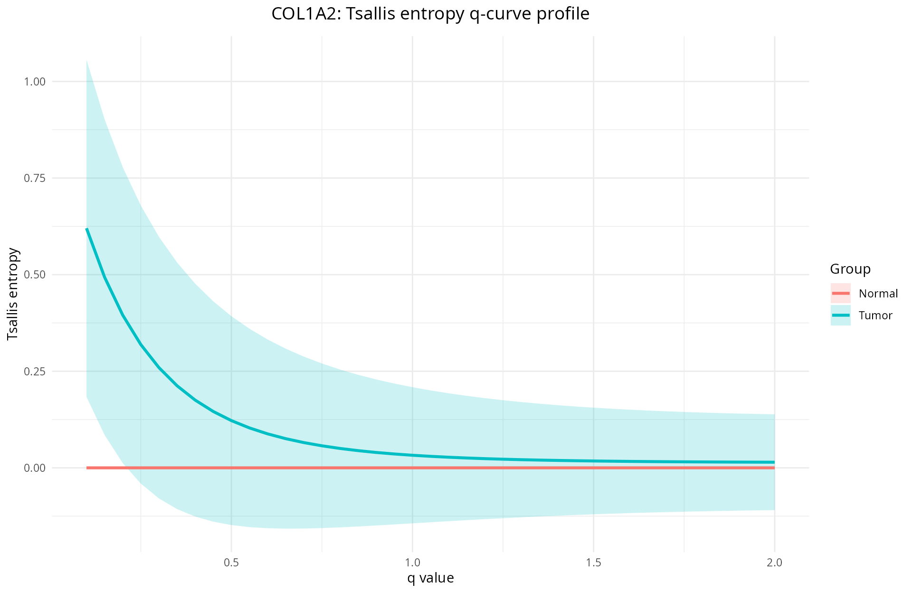
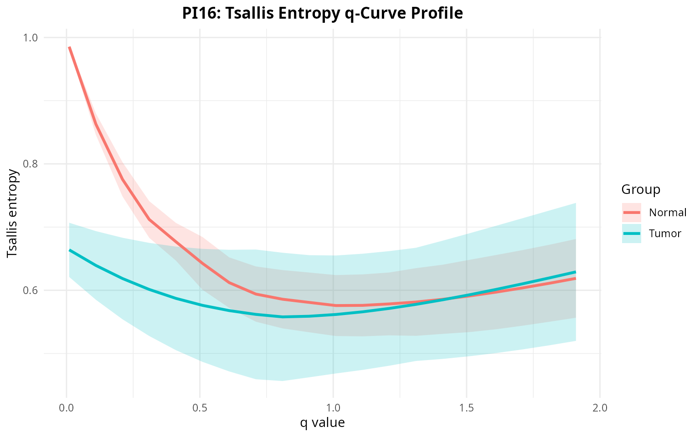
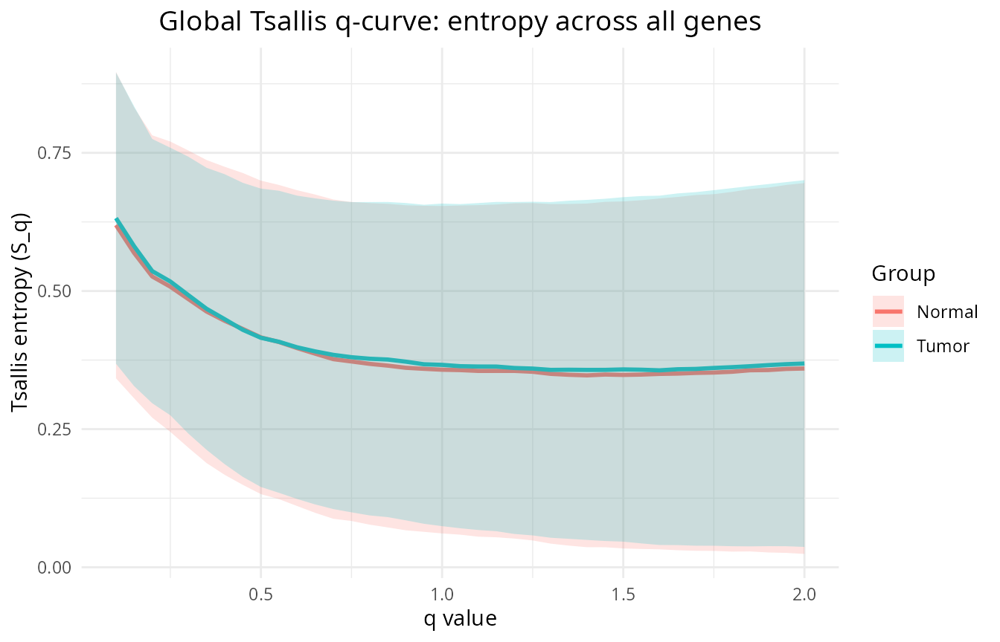

# TSENAT: Tsallis Entropy Analysis Toolbox

## Overview

This vignette shows how to compute and apply Tsallis entropy to
transcript-level expression data with `TSENAT`. It focuses on three
practical goals: (1) computing per-sample, per-gene diversity measures
across a range of sensitivity parameters `q`; (2) comparing those
measures between sample groups; and (3) visualizing and inspecting
transcript-level patterns that explain observed differences.

### Motivation

Common RNA-seq tools, such as DESEQ2 o SALMON, focus on changes in total
gene abundance. While powerful, that view can obscure an important
biological phenomenon: genes often change *which* isoforms they express
without large changes in overall expression. Tsallis entropy gives you a
single, coherent framework to describe those changes. By tuning the
parameter `q` you slide a lens across abundance scales—zooming in on
rare variants or zooming out to the dominant isoforms—so you can capture
scale-dependent isoform switching that ordinary summaries overlook.

### High-level workflow

1.  Preprocess counts and filter low-abundance transcripts.
2.  Compute relative transcript proportions within each gene and
    evaluate Tsallis entropy across one or more `q` values.
3.  Summarize per-gene values across samples (mean/median) and test for
    differences between groups (Wilcoxon or permutations).
4.  Visualize q-curves and inspect transcript-level counts for top
    genes.

## What is Tsallis entropy?

Tsallis entropy is a one-parameter family of diversity measures that
generalizes Shannon entropy via a sensitivity parameter `q`. For a
discrete probability vector $`p=(p_1,\dots,p_n)`$ it is defined as

``` math
S_q(p) = \frac{1-\sum_{i=1}^n p_i^q}{q-1}.
```

In information theory terms, entropy measures the uncertainty when
drawing a single transcript from the gene’s isoform frequency
distribution: higher entropy means the choice is less predictable (many
similarly abundant isoforms), while lower entropy means the distribution
is dominated by one or a few transcripts.

Tsallis entropy allows, throught the `q` parameter, shifts emphasis
between rare and abundant isoforms: small values of `q` make the measure
sensitive to low-abundance variants, while larger `q` focus on the
dominant species. In practice, computing `S_q` across a short grid of
`q` values (a “q-curve”) and combining this with resampling or paired
designs yields a concise, interpretable summary of isoform
heterogeneity.

**Essential limiting cases**:

- Limit $`q\to 1`$: Shannon entropy,
  $`\lim_{q\to1} S_q(p) = -\sum_i p_i\log
  p_i`$.
- $`q=0`$: richness-like (number of expressed isoforms minus one).
- $`q=2`$: Gini–Simpson / collision index, $`S_2 = 1-\sum_i p_i^2`$.
- Uniform maximum: for $`m`$ expressed isoforms,
  $`S_{q,\max}(m)=\frac{1-m^{1-q}}{q-1}`$ and normalized
  $`\tilde S_q = S_q / S_{q,\max}(m)`$.

## Example dataset

An example dataset is included for demonstration.

``` r

# Load packages
suppressPackageStartupMessages({
    library(TSENAT)
    library(ggplot2)
    library(SummarizedExperiment)
    library(mgcv)
})
```

### Load data and metadata

Now we will load the example dataset and associated metadata:

``` r

# Load required files
coldata_tsv <- system.file("extdata", "coldata.tsv", package = "TSENAT")
tx2gene_tsv <- system.file("extdata", "tx2gene.tsv", package = "TSENAT")
data("tcga_brca_luma_dataset", package = "TSENAT", envir = globalenv())

# Extract gene names and read count data
genes <- tcga_brca_luma_dataset[, 1]
readcounts <- tcga_brca_luma_dataset[, -1]

# Read sample metadata
coldata_df <- read.table(coldata_tsv,
    header = TRUE,
    sep = "\t",
    stringsAsFactors = FALSE
)
```

The next step is to inspect the loaded data to ensure it looks correct.

``` r

# Check gene names
head(genes)
#> [1] "MXRA8"   "MXRA8"   "MXRA8"   "MXRA8"   "MXRA8"   "C1orf86"

# Check read count dataset
dim(readcounts)
#> [1] 1100   40
head(readcounts[1:4, 1:3])
#>   TCGA-A7-A0CH_N TCGA-A7-A0CH_T TCGA-A7-A0D9_N
#> 1        2858.04         743.56         812.59
#> 2         127.82          21.28          50.87
#> 3         370.22          94.38         368.76
#> 4        7472.00        3564.87        7647.76

# Check the metadata
head(coldata_df)
#>           Sample Condition
#> 1 TCGA-A7-A0CH_N    Normal
#> 2 TCGA-A7-A0D9_N    Normal
#> 3 TCGA-A7-A0DB_N    Normal
#> 4 TCGA-A7-A0DC_N    Normal
#> 5 TCGA-A7-A13G_N    Normal
#> 6 TCGA-AC-A2FB_N    Normal
```

### Data preprocessing and filtering

If the transcript IDs in `readcounts` are not already set as rownames,
we need to map them. This step could be skipped if the dataset already
has transcript IDs as rownames, but in this case we need to assign them.

``` r

# Assign transcript IDs as rownames of `readcounts`
readcounts <- map_tx_to_readcounts(readcounts, tx2gene_tsv)
```

Next, we will create a a `SummarizedExperiment` data container, a
standard Bioconductor class for storing high-throughput assay data along
with associated metadata. You can read more about it in the
[Bioconductor
documentation](https://bioconductor.org/packages/release/bioc/html/SummarizedExperiment.html).

``` r

## Build a `SummarizedExperiment` from readcounts + tx2gene mapping
se <- build_se(tx2gene_tsv, readcounts, genes)
```

Before computing the Tsallis diversity, you might want to filter out
genes with a low overall expression or limit the analysis to transcripts
with a sufficient minimum expression level. Expression estimates of
transcript isoforms with zero or low expression might be highly
variable. For more details on the effect of transcript isoform
prefiltering on differential transcript usage, see [this
paper](https://doi.org/10.1186/s13059-015-0862-3).

``` r

## Filter lowly-expressed transcripts and report counts
# Keep transcripts with >5 reads in more than 5 samples using `filter_se()`
se <- filter_se(se, min_count = 5, min_samples = 5)
#> Transcripts: before = 1100, after = 848
```

We filtered lowly-expressed transcripts to reduce noise and improve the
stability of diversity estimates.

## Compute normalized Tsallis entropy.

Now we will compute Tsallis entropy for a single `q`, and inspect the
resulting assay.

Note: For single‑condition studies (no comparison groups), Tsallis
entropy can still be computed and used for descriptive analyses and
quality control; formal group‑comparison tests are not applicable in
this setting.

``` r

# compute Tsallis entropy for a single q value (normalized)
q <- 0.1
ts_se <- calculate_diversity(se, q = q, norm = TRUE)
head(assay(ts_se)[1:4, 1:3])
#>         TCGA-A7-A0CH_N TCGA-A7-A0CH_T TCGA-A7-A0D9_N
#> MXRA8        0.8616275      0.6609111      0.8156972
#> C1orf86      0.0000000      0.0000000      0.0000000
#> PDPN         0.2657489      0.2588286      0.0000000
#> ALDH4A1      0.8111864      0.4667361      0.8621495
```

An additional important technical factor is the data normalization,
which makes values comparable across genes with different numbers of
isoforms.

Now we should map the sample metadata into the `SummarizedExperiment`
object (ts_se), so plotting functions and downstream helpers can rely on
it.

``` r

ts_se <- map_metadata(ts_se, coldata_df, paired = TRUE)
```

## Differential analysis

This section summarizes practical guidance for hypothesis testing and
reporting when comparing diversity measures across sample groups.

The package integrate diverse tests for comparing per-gene diversity
summaries between two groups. Two common choices are Wilcoxon-based
tests and label-shuffle tests.

Here we will use the **Wilcoxon test**; it is the appropriate choice for
speed when sample sizes support asymptotic approximations, and it is
robust to non-normality. The **label-shuffling test** is a
non-parametric alternative that does not rely on distributional
assumptions and can be more accurate for small sample sizes, but it is
computationally intensive.

For the analyses shown in this vignette we recommend using the
**median** in the **Wilcoxon** rank-sum test for comparisons. The reason
is that Tsallis entropy values are often skewed and sensitive to
outliers, and the median provides in this condition a more robust
summary of central tendency than the mean.

``` r

# Compute differences between groups using the Wilcoxon test
# with median aggregation
res <- calculate_difference(
    ts_se,
    control = "Normal",
    method = "median",
    test = "wilcoxon",
    paired = TRUE
)
# sort results by adjusted p-value
res <- res[order(res$adjusted_p_values), ]
head(res)
#>        genes Tumor_median Normal_median median_difference log2_fold_change
#> 6   C1orf213   0.07256896    0.98702527       -0.91445631     -3.765662496
#> 17     S1PR1   0.99315946    0.99930867       -0.00614921     -0.008904999
#> 88      MBD2   0.55929534    0.07256896        0.48672638      2.946185792
#> 99      OSR1   0.79339202    0.66364511        0.12974692      0.257621943
#> 102    GFPT1   0.07256896    0.58345094       -0.51088198     -3.007186825
#> 128     KIF9   0.58141625    0.37105427        0.21036198      0.647941169
#>     raw_p_values adjusted_p_values
#> 6   0.0002357454        0.02721101
#> 17  0.0007285418        0.02721101
#> 88  0.0006535852        0.02721101
#> 99  0.0005801974        0.02721101
#> 102 0.0008919014        0.02721101
#> 128 0.0006356242        0.02721101
```

After the statistical test, in order to visualize the results and
inspect the most significant genes, we can generate two kind of
diagnostic plots: MA and volcano plots.

First we will plot a **Tsallis-based MA**, which uses the Tsallis
entropy values directly to compute fold changes and mean expression.
This plot provides a direct view of how diversity differences relate to
overall expression levels.

``` r

# MA plot (Tsallis-based)
p_ma <- plot_ma_tsallis(res)
print(p_ma)
```


Second, we will plot an **expression/readcount-based MA**, which uses
the original read counts to compute fold changes and mean expression.
This plot helps to contextualize diversity differences in terms of
overall gene expression levels.

``` r

# MA plot (expression/readcount-based)
p_ma_read <- plot_ma_expression(
    res,
    se = ts_se,
    control = "Normal"
)
print(p_ma_read)
```



On the other hands, the **volcano plot** displays the relationship
between the magnitude of diversity differences (mean difference) and
their statistical significance (adjusted p-value). This plot helps to
identify genes with both large effect sizes and strong statistical
support.

``` r

# Volcano plot: mean difference vs -log10(adjusted p-value)
p_volcano <- plot_volcano(res)
print(p_volcano)
```


### Plot top 3 genes from the single-q differential analysis

Here we will visualize the transcript-level expression for the most
significant genes identified in the previous step.

``` r

# Plot using median aggregation; let the function pick top genes from `res`
p_median <- plot_top_transcripts(ts_se,
    res = res, top_n = 3, metric = "median"
)
print(p_median)
```


We can also plot the same top genes but using variance aggregation
instead of median. This allows us to see how transcript-level expression
variability differs between groups for these genes.

``` r

# Plot using variance aggregation
p_var <- plot_top_transcripts(ts_se,
    res = res, top_n = 3, metric = "variance"
)
print(p_var)
```


## Compare between q values

Now we are going to try a different approach. In instead of evaluate the
sificant estatistical differences by using single Tsalis `q` values, we
will compute the normalized Tsallis entropy for two `q` values (0.1 and
2) to studiy potential scale-dependent patterns.

``` r

# compute Tsallis entropy for q = 1 (normalized)
q <- c(0.1, 2)
ts_se <- calculate_diversity(se,
    q = q, norm = TRUE
)
head(assay(ts_se)[1:4, 1:3])
#>         TCGA-A7-A0CH_N_q=0.1 TCGA-A7-A0CH_N_q=2 TCGA-A7-A0CH_T_q=0.1
#> MXRA8              0.8616275          0.6063802            0.6609111
#> C1orf86            0.0000000          0.0000000            0.0000000
#> PDPN               0.2657489          0.6205367            0.2588286
#> ALDH4A1            0.8111864          0.7478309            0.4667361
```

Once again, we should map the sample metadata into the multi-q
`SummarizedExperiment`. This step is important to ensure that functions
located downstream in the workflow can access the sample metadata
correctly.

``` r

ts_se <- map_metadata(ts_se, coldata_df)
```

In order to show the distributional differences between groups, we are
going to create **violin and density plots**.

The violin plot shows the distribution of Tsallis entropy values for
each group and q value, allowing us to visually assess differences in
diversity patterns between groups at different sensitivity levels.

``` r

p_violin <- plot_tsallis_violin_multq(ts_se, assay_name = "diversity")
print(p_violin)
```



The density plot provides a equivalent view of the distribution of
Tsallis entropy values, showing the density of samples across the range
of diversity values for each group and q value.

``` r

p_density <- plot_tsallis_density_multq(ts_se, assay_name = "diversity")
print(p_density)
```



## Tsallis q-sequence and linear-model interaction tests

FInally, we can test for interactions between `q` and sample groups
across a sequence of `q` values (`q-sequence`), that is, whether the
shape of the q-curve differs between groups. This approach is a powerful
way to detect scale-dependent diversity differences that may not be
apparent at a single `q` value.

Computing Tsallis entropy across a sequence of `q` values is important
because `q` acts as a sensitivity lens that shifts emphasis between rare
and dominant events in data. Thus, the resulting **q-curve** can help us
identify at which scales (i.e. for which `q` values) the diversity
differences between groups are most pronounced. The Tsallis `q-sequence`
can also help with quality control and outlier detection. By examining
the q-curves of individual samples, we can identify samples that deviate
from expected patterns, which may indicate technical issues or
biological outliers.

``` r

# compute Tsallis entropy for a sequence of values (normalized)
qvec <- seq(0.1, 2, by = 0.05)
ts_se <- calculate_diversity(se,
    q = qvec, norm = TRUE
)
head(assay(ts_se)[1:4, 1:3])
#>         TCGA-A7-A0CH_N_q=0.1 TCGA-A7-A0CH_N_q=0.15 TCGA-A7-A0CH_N_q=0.2
#> MXRA8              0.8616275             0.8073925            0.7611249
#> C1orf86            0.0000000             0.0000000            0.0000000
#> PDPN               0.2657489             0.2738368            0.2820625
#> ALDH4A1            0.8111864             0.7506492            0.7056995
```

Map once again the sample metadata into the multi-q
`SummarizedExperiment` as before.

``` r

# For paired designs ensure sample_base is created so LMMs can use it
ts_se <- map_metadata(ts_se, coldata_df, paired = TRUE)
```

Once we have the **q-sequence** computed, we can test for interactions
between `q` and sample groups using one of four methods implemented in
[`calculate_lm_interaction()`](https://gallardoalba.github.io/TSENAT/reference/calculate_lm_interaction.md):

- **linear**: fits a simple linear model. This is fast and interpretable
  and is appropriate when the q–response is approximately linear and
  samples are independent.
- **lmm**: fits a linear mixed model which accounts for subject-level
  random effects (paired or repeated measures).
- **gam**: fits a generalized additive model. This method allows to
  capture nonlinear q–response shapes.
- **fpca**: uses a functional-data approach to reduce each gene’s
  q-curve to principal component scores. This is recommended when q is
  densely sampled or when q-curves exhibit complex, high-dimensional
  variation.

Below we demonstrate a practical `lmm` example using the
**Satterthwaite** approximation for per-term inference. This method is
preferable for small or moderately sized paired RNA‑seq studies when
per-term inference is required (for example, the q:group interaction).

``` r

## Linear-model interaction test across q values: detect q x group interaction
if (requireNamespace("lme4", quietly = TRUE)) {
    # Compute and show top hits (by adjusted p-value)
    lm_res <- calculate_lm_interaction(ts_se,
        sample_type_col = "sample_type", method = "lmm",
        pvalue = "satterthwaite",
        subject_col = "sample_base")
    # show the top entries
    print(head(lm_res, 6))
}
#>      gene p_interaction         p_lrt p_satterthwaite fit_method singular
#> 1  HAPLN3 2.319271e-111 2.139688e-111   2.319271e-111       lmer    FALSE
#> 2  COL1A2  8.713853e-97  8.123588e-97    8.713853e-97       lmer    FALSE
#> 3   EEF2K  3.093021e-87  2.903439e-87    3.093021e-87       lmer    FALSE
#> 4 C1orf86  8.733394e-83  8.224552e-83    8.733394e-83       lmer    FALSE
#> 5  LRRC15  7.474347e-79  7.058969e-79    7.474347e-79       lmer    FALSE
#> 6    PI16  5.493773e-73  5.210643e-73    5.493773e-73       lmer    FALSE
#>   adj_p_interaction
#> 1     4.615350e-109
#> 2      8.670284e-95
#> 3      2.051704e-85
#> 4      4.344863e-81
#> 5      2.974790e-77
#> 6      1.822101e-71
```

### Tsallis q-sequence plot

With the **Tsallis q-sequence** we can produce a q-curve per sample and
gene. These curves show how diversity emphasis shifts from rare to
dominant isoforms as `q` increases and form the basis for interaction
tests. The q-curve shows entropy as a function of `q`. Diverging curves
between groups indicate **scale-dependent diversity differences**:
separation at low `q` implies differences in rare isoforms, while
separation at high `q` signals differences in dominant isoforms.

Now we will plot the q-curve profile for the top gene identified by the
linear-model interaction test. We will start with `HAPLN3`, which
codifies member of the hyaluronan and proteoglycan link protein family
expressed in the extracellular matrix, and closely associated with the
development and occurrence of various malignant tumors
([source](https://doi.org/10.1007/s00432-022-04421-3)).

``` r

# Plot q-curve profile for top linear-model gene
plot_target <- plot_tsallis_gene_profile(ts_se, gene = "HAPLN3")
print(plot_target)
```


Now let’s look at `COL1A2`, encodes the pro-alpha2 chain of type I
collagen, a fibril-forming collagen found in most connective tissues.

``` r

# Plot q-curve profile for top linear-model gene
plot_target <- plot_tsallis_gene_profile(ts_se, gene = "COL1A2")
print(plot_target)
```



Finally, we can visualize the gene `PI16`, which is emerging as an
important regulator in the vascular system.

``` r

# Plot q-curve profile for top linear-model gene
plot_target <- plot_tsallis_gene_profile(ts_se, gene = "PI16")
print(plot_target)
```



We can also plot the **overall Tsallis q-curve for all genes**. This
plot provides a global view of how diversity changes across the `q`
spectrum for the entire dataset and can reveal general trends in isoform
diversity.

``` r

# Plot top tsallis q curve
p_qcurve <- plot_tsallis_q_curve(ts_se)
print(p_qcurve)
```



## Practical notes and recommendations

Accurate isoform quantification is the foundation of reliable entropy
analysis. Small counts introduce noise; missing data distorts
proportions. Some important elements to keep in mind:

- **Transcript abundance filtering**: Remove very low-count transcripts
  to reduce technical noise (typical rule: drop transcripts with \<5
  reads in \>5 samples, but adjust to sequencing depth).
- **Pseudocounts**: If zeros create numerical issues, you coud add a
  small pseudocount (e.g. 1e-10). You can find more information about
  pseudocoints in this
  [paper](https://doi.org/10.1093/bioinformatics/bty471).
- **Quantification & normalization**: use bias-aware quantifiers, such
  Salmon or kallisto.

``` r

sessionInfo()
#> R version 4.5.2 (2025-10-31)
#> Platform: x86_64-conda-linux-gnu
#> Running under: Ubuntu 22.04.5 LTS
#> 
#> Matrix products: default
#> BLAS/LAPACK: /home/nouser/miniconda3/lib/libopenblasp-r0.3.30.so;  LAPACK version 3.12.0
#> 
#> locale:
#>  [1] LC_CTYPE=es_ES.UTF-8       LC_NUMERIC=C              
#>  [3] LC_TIME=de_DE.UTF-8        LC_COLLATE=es_ES.UTF-8    
#>  [5] LC_MONETARY=de_DE.UTF-8    LC_MESSAGES=es_ES.UTF-8   
#>  [7] LC_PAPER=de_DE.UTF-8       LC_NAME=C                 
#>  [9] LC_ADDRESS=C               LC_TELEPHONE=C            
#> [11] LC_MEASUREMENT=de_DE.UTF-8 LC_IDENTIFICATION=C       
#> 
#> time zone: Europe/Berlin
#> tzcode source: system (glibc)
#> 
#> attached base packages:
#> [1] stats4    stats     graphics  grDevices utils     datasets  methods  
#> [8] base     
#> 
#> other attached packages:
#>  [1] mgcv_1.9-4                  nlme_3.1-168               
#>  [3] SummarizedExperiment_1.40.0 Biobase_2.70.0             
#>  [5] GenomicRanges_1.62.1        Seqinfo_1.0.0              
#>  [7] IRanges_2.44.0              S4Vectors_0.48.0           
#>  [9] BiocGenerics_0.56.0         generics_0.1.4             
#> [11] MatrixGenerics_1.22.0       matrixStats_1.5.0          
#> [13] ggplot2_4.0.2               TSENAT_0.99.0              
#> 
#> loaded via a namespace (and not attached):
#>  [1] gtable_0.3.6        xfun_0.56           bslib_0.10.0       
#>  [4] htmlwidgets_1.6.4   lattice_0.22-7      numDeriv_2016.8-1.1
#>  [7] Rdpack_2.6.6        vctrs_0.7.1         tools_4.5.2        
#> [10] tibble_3.3.1        pkgconfig_2.0.3     Matrix_1.7-4       
#> [13] RColorBrewer_1.1-3  S7_0.2.1            desc_1.4.3         
#> [16] lifecycle_1.0.5     compiler_4.5.2      farver_2.1.2       
#> [19] textshaping_1.0.4   lmerTest_3.2-0      htmltools_0.5.9    
#> [22] sass_0.4.10         yaml_2.3.12         nloptr_2.2.1       
#> [25] pkgdown_2.2.0       pillar_1.11.1       jquerylib_0.1.4    
#> [28] tidyr_1.3.2         MASS_7.3-65         DelayedArray_0.36.0
#> [31] cachem_1.1.0        reformulas_0.4.4    boot_1.3-32        
#> [34] abind_1.4-8         tidyselect_1.2.1    digest_0.6.39      
#> [37] dplyr_1.2.0         purrr_1.2.1         labeling_0.4.3     
#> [40] splines_4.5.2       fastmap_1.2.0       grid_4.5.2         
#> [43] cli_3.6.5           SparseArray_1.10.8  magrittr_2.0.4     
#> [46] patchwork_1.3.2     S4Arrays_1.10.1     withr_3.0.2        
#> [49] scales_1.4.0        rmarkdown_2.30      XVector_0.50.0     
#> [52] lme4_1.1-38         otel_0.2.0          ragg_1.5.0         
#> [55] evaluate_1.0.5      knitr_1.51          rbibutils_2.4.1    
#> [58] viridisLite_0.4.3   rlang_1.1.7         Rcpp_1.1.1         
#> [61] glue_1.8.0          minqa_1.2.8         jsonlite_2.0.0     
#> [64] R6_2.6.1            systemfonts_1.3.1   fs_1.6.6
```
