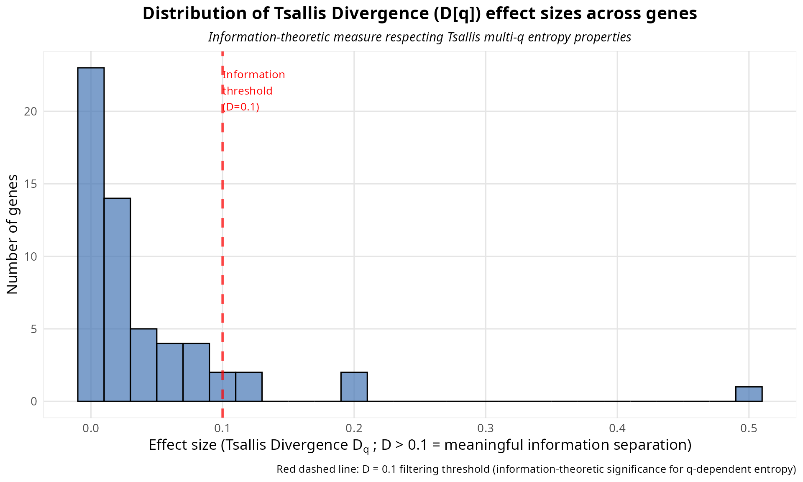

# TSENAT: Tsallis Entropy Analysis Toolbox

## Overview

TSENAT (Tsallis Entropy Analysis Toolbox) quantifies **isoform
heterogeneity** in RNA-seq data using Tsallis entropy-a scale-dependent
diversity measure distinct from abundance-focused tools (DESeq2, Salmon)
and differential transcript usage packages (*SplicingFactory*). By
tuning a sensitivity parameter `q`, users examine diversity at different
scales: rare variants (low `q`) or dominant isoforms (high `q`). This
package enables computing Tsallis entropy from transcript-level
abundance estimates, comparing measures between groups, and visualizing
scale-dependent differences via q-curves.

### Motivation and Bioconductor Contribution

Common RNA-seq tools focus on either total gene abundance changes or
individual transcript usage shifts. Yet genes often remodel their
isoform landscapes without changing overall expression-a phenomenon
missed by these approaches. TSENAT quantifies this *isoform complexity*
directly via Tsallis entropy, a scale-dependent diversity framework
tuned by parameter `q`. By sliding `q` across scales, researchers zoom
between rare variants (low `q`) and dominant isoforms (high `q`),
capturing biological signal invisible to abundance- or proportion-based
summaries.

In this guide, we demonstrate the complete workflow: preprocessing
transcript counts, computing entropy across entropic indices, testing
for between-group differences, and visualizing scale-dependent
complexity.

### High-level workflow

1.  **Load and preprocess** transcript counts and filter low-abundance
    transcripts.
2.  **Compute diversity** (Tsallis entropy) and **divergence** (Tsallis
    divergence).
3.  **Test for differences** in entropy patterns between groups across
    entropic indices.
4.  **Visualize results**.

Design assumptions: This guide assumes paired or longitudinal designs
with \>=6-8 samples per group for adequate power to detect entropy
shifts while controlling false discovery rate. Smaller sample sizes may
be underpowered to detect subtle isoform complexity changes.

### Installation

To install `TSENAT` from Bioconductor:

``` r

if (!require("BiocManager", quietly = TRUE))
    install.packages("BiocManager", repos = "http://cran.us.r-project.org")
BiocManager::install("TSENAT")
```

Then load the package:

``` r

library(TSENAT)
```

### Quick Start

For users who want to see results quickly, here is a minimal workflow:

``` r

library(TSENAT)
library(SummarizedExperiment)

# Load example data
data("readcounts", package = "TSENAT")
readcounts <- as.matrix(readcounts)

# Load sample metadata and annotation
metadata_df <- read.table(
  system.file("extdata", "metadata.tsv", package = "TSENAT"),
  header = TRUE, sep = "\t"
)
gff3_file <- system.file("extdata", "annotation.gff3.gz", package = "TSENAT")

# Create analysis object with transcript counts, annotation, and metadata
config <- TSENAT_config(
  sample_col = "sample",
  condition_col = "condition",
  paired = TRUE,
  subject_col = "paired_samples",
  control = "normal",
  q = seq(0, 2, by = 0.05)
)

## Build TSENATAnalysis object
analysis <- build_analysis(
  readcounts = readcounts, 
  tx2gene = gff3_file,
  metadata = metadata_df,
  config = config,
  tpm = tpm,
  effective_length = effective_length)

# Filter low-abundance transcripts
analysis <- filter_analysis(analysis)

# Compute Tsallis entropy using S4 wrapper (using single q value for quick start)
analysis <- calculate_diversity(analysis)

# Plot overall q-curve
p_qcurve <- plot_diversity_spectrum(
    analysis, 
    dev_width = 12,
    dev_height = 8)
print(p_qcurve)
```

## What is Entropy and Tsallis Entropy?

The concept of **entropy** originated in Claude Shannon’s landmark 1948
paper on information theory (Shannon 1948), which established that
information content could be quantified mathematically through the
fundamental concepts of uncertainty and surprise. Shannon entropy became
the foundation for understanding complexity across mathematics, physics,
and biology—if you draw a transcript from a distribution, how
predictable is the outcome?

However, Shannon entropy treats all elements equally, regardless of
their frequency: it weights rare and common elements identically. This
led mathematicians and physicists to explore **generalized entropy
families** that could emphasize different aspects of distributions. Two
major generalizations emerged: Rényi’s parametric family of entropies
and Tsallis entropy, both of which introduced tunable parameters that
allow sensitivity to rare versus abundant elements.

The key insight is that Tsallis and Rényi entropies, despite appearing
different mathematically, can be unified within a coherent framework
through generalized logarithmic and exponential functions (Tsallis
2017). Both frameworks answer a fundamental question: **What
organizational scales matter?** By changing the q parameter, you shift
emphasis from rare (low q) to abundant (high q) elements—qualitatively
different perspectives on the same distribution.

More recently, **Hill numbers** (Chao et al. 2010) provided a modern
ecological framework that reinterprets all generalized entropy measures
as “true diversity” of different orders. This formulation clarified that
diversity questions have scale-dependent answers: rare species and
dominant species reveal different ecological (or in our case,
transcriptomic) truths. The Hill numbers framework unified richness
(q=0), Shannon entropy (q=1), Simpson/Gini (q=2), and higher-order
generalizations under a single mathematical umbrella.

TSENAT applies this intellectual progression to RNA-seq data: instead of
asking only “which genes change abundance,” it asks “how does the
organization of isoforms change across multiple scales of complexity?”
By leveraging Tsallis entropy’s multi-scale nature and the Hill numbers
interpretation, TSENAT captures the full diversity spectrum of isoform
organization, revealing biological signals invisible to traditional
abundance-focused methods.

### Why This Matters for RNA-seq: The Isoform Complexity Problem

Standard RNA-seq analysis measures *whether* transcript abundance
changes between conditions. But a critical complementary question
remains underexplored: *how* does the diversity of isoforms change? A
gene may show little change in total abundance while dramatically
reshuffling its isoform repertoire—a phenomenon that current methods
largely miss.

**Entropy** quantifies precisely this: the complexity, richness, and
balance of isoform heterogeneity. By measuring entropy across different
biological scales (the parameter `q` introduced above), researchers can
detect whether changes are driven by shifts in rare isoforms (low q) or
reorganization of dominant variants (high q). The beauty of the Tsallis
framework is that you obtain a complete picture of isoform heterogeneity
by computing across a range of entropic indices—a “q-curve”—revealing
which aspects of isoform organization change between conditions.

### Mathematical Foundation and Interpretation

#### Tsallis Entropy: Definition and Intuition

For a discrete probability vector $`p = (p_1, \ldots, p_n)`$
representing isoform proportions within a gene, Tsallis entropy is
defined as:

``` math
S_q(p) = \frac{1-\sum_{i=1}^n p_i^q}{q-1}.
```

This parametric family unites diverse entropy concepts under a single
framework:

- **Generalization**: Extends beyond Shannon entropy to capture
  scale-dependent phenomena
- **Mathematical elegance**: Reduces to well-known diversity indices at
  specific entropic indices
- **Practical flexibility**: Enables data-driven exploration across the
  full diversity spectrum

#### Information-Theoretic Meaning

From an information theory perspective (Shannon 1948; Furuichi 2006),
entropy measures the uncertainty or surprise when drawing a single
transcript from an isoform distribution. Higher entropy means the draw
is less predictable (many similarly abundant isoforms), while lower
entropy means one or a few isoforms dominate. This distinction is
crucial: two genes with identical total abundance may have dramatically
different isoform complexity.

The **q parameter acts as a sensitivity dial** that controls which
aspects of the distribution become visible:

- **q \< 1** (e.g., 0.5): Emphasizes rare, low-abundance isoforms;
  useful for discovering cryptic or condition-specific variants.
- **q = 1**: Recovers Shannon entropy; provides balanced sensitivity
  across all abundance scales.
- **q \> 1**: Emphasizes dominant, abundant isoforms; captures core
  expression architecture.

### Biological Potentiality: Why TSENAT Matters

Tsallis entropy is grounded in Shannon’s foundational information theory
(Shannon 1948), generalized by Renyi’s family of entropies (Jost 2006),
and extended by Tsallis (Furuichi 2006). The key innovation is a tunable
parameter `q` that controls sensitivity to different aspects of the
diversity distribution-which aspects of isoform heterogeneity become
visible depends on the entropic index chosen (Anastasiadis 2012;
Ramírez-Reyes et al. 2016; Alomani and Kayid 2023).

As stated explicitly in the mathematical literature: “This introduces
the formal possibility not to set rare and common events on the same
footing, as in BG or Shannon statistics, but it enhances or depresses
them according to the parameter chosen.” This principle is formalized in
the Hill numbers framework (Chao et al. 2010), which unifies diverse
entropy-based measures (richness, Shannon, Simpson) as different
manifestations of the same parametric family with varying sensitivity to
abundance scales.

The flexibility is crucial for isoform analysis. The concept of “true
diversity” (Chao et al. 2010) emphasizes that diversity can be
decomposed into two independent components: species richness (how many
distinct isoforms exist) and evenness (how evenly distributed they are
across the population). Two genes can have identical Shannon entropy yet
differ dramatically in isoform structure: one might be dominated by a
single abundant isoform (maximizing apparent heterogeneity at low `q`
where rare variants matter), while another distributes transcripts
across many isoforms equally (maximizing heterogeneity across all `q`
values). By tuning the q-parameter according to Tsallis entropy theory
(Anastasiadis 2012; Tsallis 2017), we can vary the weight on rare events
(high q) to reveal dominant isoform patterns, or enhance rare-event
weight (low q) to reveal cryptic isoform complexity. TSENAT’s multi-*q*
approach captures this full spectrum of isoform diversity, enabling
researchers to detect both rare isoform innovations and robust isoform
usage patterns (Seweryn et al. 2020) by exploring the q-curve across
multiple scales.

### Applications and Evidence: Why Multi-Scale Entropy Matters

The multi-scale nature of Tsallis entropy makes it suited for exploring
isoform complexity across diverse biological contexts. By measuring
information content at different entropic indices, researchers can
detect patterns invisible to traditional transcript abundance measures
alone. The recent emphasis on information-theoretic approaches in
computational biology Bajić (2024) reflects broader recognition that
complex biological systems encode information across multiple
organizational scales.

#### Biological Contexts Where Scale-Dependent Analysis Reveals Hidden Complexity

**Isoform complexity as a biological signal**: Isoform
switching—reorganization of the isoform landscape without necessarily
changing total gene abundance—reflects strategic shifts in protein
function driven by splicing regulation. Evidence from single-cell
transcriptomics demonstrates that transcript-level complexity varies
systematically across cell types and developmental states (Cao et al.
2017), validating that isoform heterogeneity is a genuine biological
phenomenon rather than noise. Different biological processes prioritize
different organizational scales (Tarabichi et al. 2013):

- Changes in rare isoform usage (revealed through low `q` sensitivity)
  might reflect exploratory or error-correction mechanisms
- Shifts in dominant isoform selection (revealed through high `q`
  sensitivity) might reflect functional specialization or robustness
  demands
- The full q-curve reveals whether cellular transitions involve
  wholesale reorganization or targeted adjustments

TSENAT enables detection of these changes through entropy-based
approaches, which capture whether complexity is increasing (diversity
spreading across isoforms) or decreasing (consolidation onto dominant
isoforms).

**Beyond classical abundance measures**: Traditional RNA-seq analysis
focuses on fold-changes and differential abundance. Since isoform
reorganization can occur independently of total abundance changes,
entropy-based approaches complement classical methods by detecting
complexity shifts that transcript-level statistics alone cannot reveal.

#### Mechanistic Evidence from Disease and Evolution

Peer-reviewed literature provides strong empirical support for
entropy-based analysis in biological contexts:

**Entropy and cancer heterogeneity**: Cancer cells accumulate genetic
and epigenetic perturbations that systematically increase disorder in
gene regulatory networks. Tarabichi and colleagues demonstrate that
“Increased entropy of signaling (or gene interaction networks) has been
well studied as a cancer characteristic: Network entropy increases along
with cancer progresses” (Tarabichi et al. 2013). Nijman’s complementary
analysis reveals the mechanism: “cancer-associated perturbations
collectively disrupt normal gene regulatory networks by increasing their
entropy. Importantly, in this model both somatic driver and passenger
alterations contribute to ‘perturbation-driven entropy’, thereby
increasing phenotypic heterogeneity and evolvability” (Nijman 2020).
This framework elegantly explains observed cancer heterogeneity without
requiring that every genetic change confers an advantage—some mutations
contribute entropy directly through network disruption. Increased
entropy in gene regulatory networks thus drives phenotypic heterogeneity
and cellular plasticity, suggesting that transcript-level entropy
captures similar organizational principles (Nijman 2020).

**Single-cell validation of systematic isoform organization**: Cao and
colleagues’ landmark study provided empirical validation that
transcript-level organization varies systematically across cell types:
“expression levels of mRNA species are linked to cellular function and
therefore can be used to classify cell types” (Cao et al. 2017). Their
comprehensive profiling of *C. elegans* demonstrates that individual
cells maintain specific, consistent isoform compositions reflecting
cellular identity—establishing that isoform complexity is not noise but
a fundamental aspect of cellular differentiation and function.

#### Synthesis: From Theory to Application

These perspectives—entropy as driver of cancer evolution, perturbations
as network disruption mechanisms, and single-cell evidence for
systematic isoform organization—converge on a unified framework.
Measuring entropy at multiple scales captures biologically meaningful
variation in cellular organization and adaptation. Entropy concepts have
mechanistic relevance beyond abstract information theory: they explain
how perturbations increase heterogeneity and plasticity in living
systems. Tsallis entropy, through its parametric q-spectrum, provides a
systematic framework for exploring this multi-scale organization at the
transcript and isoform level, enabling TSENAT to detect biological
signals that would remain invisible to single-scale approaches.

## TSENAT Main Workflow

We now demonstrate a complete workflow for detecting **isoform
switching**-when cells reorganize their isoform landscape without
necessarily changing total gene abundance. This often reflects strategic
shifts in protein function driven by splicing regulation.

In this workflow, you will:

1.  Load transcript counts and sample metadata
2.  Identify genes with significant scale-dependent isoform complexity
    changes (using linear model interaction testing)
3.  Assess which individual transcripts drive those changes (using
    jackknife resampling (Efron and Tibshirani 1993))
4.  Interpret results in the context of paired experimental designs

We’ll work with a paired experimental design where treated and control
samples are linked, enabling detection of robust biological signals
while controlling for subject-level variability. By the end, you’ll know
not just *which genes* undergo isoform switching, but *which
transcripts* are responsible and *at which diversity scales* the
switching occurs.

### Load data and metadata

An example dataset is included for demonstration.

``` r

# Load packages
suppressPackageStartupMessages({
    library(TSENAT)
    library(ggplot2)
    library(SummarizedExperiment)
})

# Setup random seed for reproducibility
set.seed(42)
```

Now we will load the example dataset and associated metadata:

``` r

# Load example dataset (lazy-loaded as 'readcounts' by default)
# This includes SALMON preprocessing outputs:
# - readcounts: transcript-level NumReads (raw fragment counts)
# - tpm: TPM matrix (length- and library-normalized estimates)
# - effective_length: EffectiveLength vector (read-length corrected)
data(readcounts)

readcounts <- as.matrix(readcounts)

metadata_df <- read.table(
    system.file("extdata", "metadata.tsv", package = "TSENAT"),
    header = TRUE, sep = "\t"
)

gff3_file <- system.file("extdata", "annotation.gff3.gz", package = "TSENAT")
```

### Data preprocessing and filtering

Next, we will create a `TSENATAnalysis` object containing a
`SummarizedExperiment` data container (a standard Bioconductor class for
storing high-throughput assay data along with associated metadata). You
can read more about it in the [Bioconductor
documentation](https://bioconductor.org/packages/release/bioc/html/SummarizedExperiment.html).

We will use the GFF3.gz annotation file for extracting the
transcript-to-gene mapping and building the analysis object. We’ll also
include sample metadata for improved analysis. Following Bioconductor
best practices, we create the configuration FIRST, then pass it to the
builder function (fail-fast principle):

``` r

## Configure analysis parameters first (best practice: fail-fast principle)
## This validates all parameters before object creation
config <- TSENAT_config(
  sample_col = "sample",
  condition_col = "condition",
  subject_col = "paired_samples",
  q = seq(0, 2, by = 0.05),
  nthreads = 2,
  paired = TRUE,
  control = "normal"
)

## Build a complete `TSENATAnalysis` object 
analysis <- build_analysis(
  config = config,
  readcounts = readcounts,
  metadata = metadata_df,
  tx2gene = gff3_file, 
  tpm = tpm,
  effective_length = effective_length
)
```

The `TSENATAnalysis` object contains a `SummarizedExperiment` with
transcript-level counts and gene annotations extracted from the GFF3
file.

To reduce noise and improve statistical power, we should filter out
lowly-expressed transcripts. Expression estimates of transcript isoforms
with zero or low expression might be highly variable (Jose and Lal 2013;
Chakraborty 2019). For more details on the effect of transcript isoform
prefiltering on differential transcript usage, see [this
paper](https://doi.org/10.1186/s13059-015-0862-3).

``` r

# Filter lowly-expressed transcripts
analysis <- filter_analysis(analysis, stringency = "medium")
```

The `stringency = "medium"` parameter keeps transcripts present in
\>=50% of samples with TPM values above the median of mean gene TPM.
This balances noise reduction with preservation of isoform diversity
needed for meaningful entropy calculations.

### Compute Tsallis Entropy

We now compute Tsallis entropy across your configured q-spectrum.
Diversity measures provide a comprehensive framework for assessing
isoform heterogeneity at multiple scales (Ramírez-Reyes et al. 2016;
Gandrillon et al. 2021). We normalize entropy to \[0,1\] range
(`norm = TRUE`) for comparable cross-q assessment.

``` r

# Set random seed for reproducible bootstrap CI calculations
set.seed(12345)

# Compute diversity using S4 wrapper with bootstrap confidence intervals [@S232; @S115]
# Uses q-spectrum from config (seq(0, 2, by=0.05) as configured above)
analysis <- calculate_diversity(
    analysis,
    norm = TRUE
)

# Extract and display diversity results
diversity <- results(analysis, type = "diversity", n_genes = 4, sample = "SRR14800481")
print(diversity)
```

Note: Diversity results not available for the requested q-values. Ensure
calculate_diversity() was run with appropriate q-value configuration.

With the q-spectrum we can produce a q-curve per sample and gene. These
curves show how diversity emphasis shifts from rare to dominant isoforms
as `q` increases and form the basis for interaction tests. The q-curve
shows entropy as a function of `q`. Diverging curves between groups
indicate scale-dependent diversity differences: separation at low `q`
implies differences in rare isoforms, while separation at high `q`
signals differences in dominant isoforms.

``` r

# Plot overall q-curve
p_qcurve <- plot_diversity_spectrum(analysis)
print(p_qcurve)
```


**Figure 1:** Isoform diversity profiles across entropic indices. Lines
show normalized Tsallis entropy (0-1) for each sample, blue control and
red treatment.

### Quality Control: Sample Influence Assessment

Before proceeding with group-level comparisons, we should assess whether
individual samples exert disproportionate influence on our entropy
estimates (Efron, Bradley and Tibshirani, Robert J. 1993). To address
this, we employ a leave-one-out influence assessment combined with
robust M-estimation (Ernst 2004) (iteratively re-weighted least squares
with Huber loss). This approach quantifies how much each sample’s
removal affects the estimated location differences across the
q-spectrum, providing a sample-level quality control metric independent
of group assignment.

Samples with high influence scores exert disproportionate leverage on
entropy estimates and may warrant deeper investigation for technical
quality issues, subject-specific outliers, or genuine biological signals
that require careful interpretation.

We configure three key parameters: `loss_type = "huber"` employs Huber
M-estimation (robust to outliers with bounded influence),
`q_combine_method = "mean"` averages influence metrics across the entire
q-spectrum for a single score per sample, and
`influence_threshold = 0.75` designates the percentile cutoff above
which samples are flagged (such that the top 25% most influential
samples are reviewed).

``` r

# Perform multi-q sample influence analysis via S4 wrapper
analysis <- calculate_m_estimator(
    analysis,
    loss_type = "huber",
    q_combine_method = "mean",
    influence_threshold = 0.75
)

# Extract results from metadata using accessor function
sample_qc <- metadata(analysis, "m_estimate_results")
print(sample_qc)
```

| Sample | Condition | Proportion_Affected | Genes_Affected | Entropy_Mean | Entropy_SD | Distance_from_Centroid | Status |
|:---|:---|---:|---:|---:|---:|---:|:---|
| SRR14800481 | normal | 0.847 | 64.4 | 0.6936 | 0.2364 | 1.7930 | OK |
| SRR14800480 | normal | 0.806 | 61.2 | 0.7345 | 0.1972 | 1.2384 | OK |
| SRR14800477 | normal | 0.833 | 63.3 | 0.6896 | 0.2852 | 1.5809 | OK |
| SRR14800476 | normal | 0.889 | 67.6 | 0.7310 | 0.2329 | 0.9118 | OK |
| SRR14800475 | normal | 0.861 | 65.4 | 0.6774 | 0.2435 | 1.6796 | OK |
| SRR14800490 | normal | 0.849 | 64.5 | 0.6843 | 0.2357 | 1.3522 | OK |
| SRR14800489 | normal | 0.875 | 66.5 | 0.7339 | 0.2426 | 1.0969 | OK |
| SRR14800488 | normal | 0.861 | 65.4 | 0.6738 | 0.2649 | 1.6536 | OK |
| SRR14800479 | tumor | 0.861 | 65.4 | 0.6842 | 0.2721 | 2.2114 | OK |
| SRR14800478 | tumor | 0.903 | 68.6 | 0.7345 | 0.2440 | 1.5721 | Flag for QC |
| SRR14800487 | tumor | 0.861 | 65.4 | 0.7257 | 0.2193 | 1.2201 | OK |
| SRR14800486 | tumor | 0.903 | 68.6 | 0.7207 | 0.2497 | 1.4798 | Flag for QC |
| SRR14800485 | tumor | 0.861 | 65.4 | 0.7334 | 0.2131 | 1.4140 | OK |
| SRR14800484 | tumor | 0.889 | 67.6 | 0.7382 | 0.2095 | 1.1499 | OK |
| SRR14800483 | tumor | 0.861 | 65.4 | 0.7425 | 0.2283 | 1.6020 | OK |
| SRR14800482 | tumor | 0.917 | 69.7 | 0.7186 | 0.2446 | 1.6711 | Flag for QC |

**Table 2 \| Sample Influence Assessment via M-estimation.** Ranked by
magnitude of resampling-based influence values. Columns: Sample
identifier; mean and standard deviation of Tsallis entropy; distance
from centroid; outlier status. M-estimation identifies influential
samples for sensitivity analysis. {.table .table .table-striped
.table-hover style="margin-left: auto; margin-right: auto;"}

**Interpretation:** Samples with distance from centroid \>1.5 or
proportion of affected genes \>0.85 are flagged for quality control
review. Flagged samples may reflect genuine biological heterogeneity or
technical artifacts requiring careful examination before proceeding with
downstream analysis.

### Linear-Model interaction

Each gene produces a **q-curve**: a trajectory showing how entropy
changes across entropic scales from rare (low `q`) to abundant (high
`q`) isoforms. Our goal is to detect whether this curve differs between
groups—in other words, whether the effect of `q` on entropy **depends
on** which group a sample belongs to. This is captured statistically as
a **q x condition interaction**: if significant, it reveals genes with
condition-specific diversity patterns that change shape across the
diversity spectrum. Linear models (and their extensions) naturally
formalize this multi-scale comparison, making them ideal for identifying
such scale-dependent biological signals.

We can test for these interactions using one of four methods, each with
specific strengths:

- GAM (generalized additive model): flexibly captures nonlinear
  q-response patterns via adaptive smoothing splines. Default method.
- LMM (linear mixed models): models subject-level random intercepts to
  account for within-subject correlation in repeated q-ordered
  measurements.
- GEE (generalized estimating equations): particularly useful for paired
  and longitudinal designs with repeated q-measures.
- FPCA (functional principal component analysis): treats q-values as
  ordered functional data, implicitly capturing q-ordering structure.

All methods automatically account for the AR(1) correlation structure
inherent in Tsallis entropy measurements.

``` r

# Linear-model interaction test across q values using S4 wrapper
analysis <- calculate_lm(
    analysis,
    method = "gam",
    multicorr = "hochberg"
)
       
# Extract LM interaction results
lm_results <- results(analysis, type = "lm", rankBy = "pvalue", n = 10)

print(lm_results)
```

| Gene | Gene Name | P-value | Adj. P-value | Effect Size | Test Statistic | Model Converged | Heteroscedasticity |
|:---|:---|:---|:---|---:|---:|:---|:---|
| CXCL12 | CXCL12 | 3.93e-164 | 2.99e-162 | 0.8127 | 752.5086 | TRUE | TRUE |
| THY1 | THY1 | 9.80e-97 | 7.35e-95 | 0.6008 | 442.1369 | TRUE | TRUE |
| ING3 | ING3 | 2.72e-77 | 2.02e-75 | 0.3533 | 352.5945 | TRUE | TRUE |
| SNHG10 | SNHG10 | 9.81e-75 | 7.16e-73 | 0.0515 | 340.8200 | TRUE | TRUE |
| LINC03040 | LINC03040 | 1.87e-57 | 1.35e-55 | 0.7380 | 261.2380 | TRUE | TRUE |
| HDAC2 | HDAC2 | 2.61e-51 | 1.85e-49 | 0.2844 | 232.9431 | TRUE | TRUE |

**Table 3 \| Leading genes with scale-dependent condition effects from
generalized additive models.** We display the 6 genes with lowest
adjusted p-values (*q* \< 0.05). Benjamini-Hochberg correction applied;
columns show gene identifier, effect size, test statistic, convergence
status, and heteroscedasticity detection. Methods: GAMs with *q* and
condition as smooth predictors (Benjamini and Hochberg 1995). {.table
.table style="margin-left: auto; margin-right: auto;"}

**Interpretation:** TRUE in the Heteroscedasticity column indicates that
the model satisfies homogeneity-of-variance assumptions across the
q-spectrum; FALSE values suggest variance heterogeneity and warrant
caution in result interpretation.

Now we will plot the q-curve profile for the top genes identified by the
linear-model interaction test.

``` r

# Plot q-curve profiles for the top 4 genes using the S4 wrapper
combined_plot <- plot_lm(
    analysis,
    n_top = 4
)
print(combined_plot)
```


**Figure 2:** Scale-dependent interaction analysis. GAM-identified genes
showing significant q$`\times`$condition effects (Benjamini-Hochberg q
\< 0.05).

### Transcript Switching Across Diversity Scales

The LM interaction tests whether condition effects depend on which
diversity scale (q-value) you examine. This section identifies **which
individual transcripts** drive these scale-dependent patterns, revealing
whether the same transcripts switch across all scales or whether
different regulatory mechanisms dominate at rare versus abundant isoform
scales.

#### Two-Stage Analysis Approach

This workflow combines two complementary statistical methods:

1.  **Multi-*q* LM interaction test**: Tests whether the condition
    effect on diversity depends on *q* (overall pattern across diversity
    scales)
2.  **Single-*q* jackknife resampling**: Tests which individual
    transcripts drive those patterns at each *q*-value, with robustness
    assessment

**Delta influence** (from jackknife resampling (Efron, Bradley and
Tibshirani, Robert J. 1993)) quantifies *how each transcript’s relative
importance changes between normal and tumor conditions*, weighted by
stability across bootstrap iterations (positive = more influential in
normal condition; negative = more influential in tumor condition).

#### Key Interpretation Questions

- **Consistent switching**: Do the same transcripts show significant
  delta influence across all *q*-values? Suggests robust,
  scale-independent splicing shift.
- **Mixed/scale-dependent switching**: Do different transcripts matter
  at different *q*-values? Suggests regulatory complexity where
  mechanisms differ by scale.
- **Classification**: Does isoform reorganization involve the same
  transcripts across scales, or a layered process where different
  regulatory inputs dominate at rare vs. abundant scales?

``` r

# Multi-Q analysis: Test switching at different q values
analysis <- calculate_jis(
    analysis,
    q = c(0, 0.5, 1, 1.5, 2),
    nboot = 100,
    lm_p_threshold = 0.05,
    threshold = 90
)
```

We configure three key parameters for the switching analysis:
`nboot = 100` specifies 100 bootstrap resamples to estimate robust
confidence intervals for delta influence values (Efron, Bradley and
Tibshirani, Robert J. 1993); `lm_p_threshold = 0.05` filters genes to
those with significant q$`\times`$condition interaction effects (p \<
0.05) before assessing transcript switching; and `threshold = 90`
designates transcripts with support $`\geq`$ 90% across bootstrap
samples as robust switches. These parameters balance sensitivity
(detecting switching) with specificity (avoiding false positives from
noise).

The tables below show the transcript switching patterns for the top
genes with strongest q×condition interactions, automatically computed
via bootstrap resampling. The `Direction Consistency` column classifies
each transcript: “Consistent” indicates stable switching across entropic
indices, while “Mixed” indicates scale-dependent switching. This reveals
whether isoform shifts involve the same transcripts across scales or
whether different entropic indices emphasize different transcripts.

``` r

# Retrieve gene switching tables (default format="text" returns structured list)
# format="text" returns: $gene_headers, $comparison_tables, $q_metadata for vignette display
# format="raw" returns original named list of data frames per gene for direct access
tables_result <- results(analysis, type = "switching_tables")
```

##### Gene: CXCL12 (ENSG00000107562.18)

| Transcript         | q=0.00 | q=0.50 | q=1.00 | q=1.50 | q=2.00 | Direction Consistency |
|:-------------------|-------:|-------:|-------:|-------:|-------:|:----------------------|
| ENST00000343575.11 | -0.033 |  0.000 |  0.041 |  0.062 |  0.073 | Mixed directions      |
| ENST00000374426.6  |  0.046 | -0.063 | -0.051 | -0.040 | -0.035 | Mixed directions      |
| ENST00000374429.6  | -0.033 |  0.164 |  0.156 |  0.123 |  0.112 | Mixed directions      |

##### Gene: THY1 (ENSG00000154096.15)

| Transcript        | q=0.00 | q=0.50 | q=1.00 | q=1.50 | q=2.00 | Direction Consistency |
|:------------------|-------:|-------:|-------:|-------:|-------:|:----------------------|
| ENST00000524970.5 | -0.198 | -0.046 |  0.002 |  0.014 |  0.020 | Mixed directions      |
| ENST00000900758.1 |  0.196 |  0.045 |  0.031 |  0.019 |  0.016 | Consistent positive   |
| ENST00000956364.1 |  0.118 | -0.075 | -0.092 | -0.102 | -0.108 | Mixed directions      |

#### Delta Influence Across Diversity Scales

Visualize switching patterns for the top genes identified by the LM
interaction test. This shows which transcripts are switching in genes
with significant q × condition interaction effects. The heatmaps below
display **jackknife delta influence** (Efron and Tibshirani 1993)-a
resampling-based measure of how robustly each transcript’s relative
contribution changes between conditions-across different entropic
indices and transcripts for each gene. Delta influence values are
computed from bootstrap resampling iterations, providing robust,
non-parametric estimates of transcript switching significance weighted
by consistency across replicates.

``` r

# Generate multi-Q heatmaps for top 4 genes using S4 wrapper
plot_jis_delta(analysis, n_genes = 4)
```


**Figure 3:** Transcript-level switching patterns via jackknife
resampling. Rows q-values (0-2.0), columns transcripts. Red/blue
indicates condition influence.

**Interpretation:** Rows represent q-values across the diversity
spectrum (0 to 2.0, with low q emphasizing rare isoforms and high q
emphasizing abundant isoforms).

- **Red cells** indicate transcripts with strong positive delta
  influence in the **normal condition** (first condition)—meaning these
  transcripts became *more important* in normal samples compared to
  tumor samples.
- **Blue cells** indicate negative delta influence in the normal
  condition (or equivalently, positive influence in the tumor
  condition)—meaning these transcripts became *less important* in normal
  samples but *more important* in tumor samples.
- **Color intensity** reflects robustness across bootstrap resamples:
  bright red/blue = consistent signal, pale/white = noisy or uncertain
  signal.

This robustness-weighted visualization reveals not just *which*
transcripts switch, but *how reliably* they switch, allowing distinction
between robust biological signals and artifacts of sampling variation.

``` r

# Generate transcript abundance heatmap
plot_expression(analysis, top_n = 4, metric = "median")
```


**Figure 4:** Transcript abundance heatmap with hierarchical clustering.
Rows are transcripts, columns are conditions. Blue low, red high
expression.

**Interpretation:** Transcripts (rows) are hierarchically clustered by
expression similarity. Red indicates high expression, blue indicates low
expression. Distinct horizontal bands reveal condition-specific
isoforms; uniform coloring suggests constitutive expression. Clustering
reveals which transcripts co-vary in expression patterns across
conditions.

#### Effect size analysis

To understand which diversity scales show the most pronounced biological
differences between groups, we compute effect size metrics (Tsallis
divergence $`D_q`$) across the q-spectrum while respecting the paired
sample design. This reveals whether group differences are driven by rare
isoforms (low q), dominant isoforms (high q), or uniformly across
scales.

The approach uses linear mixed-effects regression (LMM) with q as
continuous predictor to assess slope differences in entropy change
across the q-spectrum between treatment groups, with effect size
computed as Tsallis divergence $`D_q`$(control\|\|treatment) (Kullback
and Leibler 1951; Furuichi 2006; Jost 2006; Erven and Harremoes 2014;
Sason 2022). For paired designs, divergence is computed separately for
each pair and then averaged, accounting for within-pair correlation and
reducing noise from between-pair variation (Yulmetyev et al. 2004).

The mean divergence across q values serves as the effect size,
automatically capturing how entropy distributions differ between control
and treatment groups at all scales (rare to abundant isoforms). Values
$`D > 0.1`$ indicate meaningful information-theoretic separation between
conditions, revealing that isoform complexity patterns fundamentally
differ between treatment groups across all q-dependent scales (R0̆0e9 and
Azad 2014). This information-theoretic measure automatically respects
Tsallis entropy properties and adapts to each q value, enabling
scale-dependent effect size estimation (Shiner et al. 2002).

``` r

# Computes pairwise information-theoretic distance (Tsallis divergence)
analysis <- calculate_divergence(analysis)

# Extract divergence results
divergence_results <- results(analysis, type = "divergence")
head(divergence_results, n = 10)
```

|         |  q_0.01 |  q_0.05 |   q_0.1 |
|:--------|--------:|--------:|--------:|
| FOXJ2   | 0.04377 | 0.04633 | 0.04952 |
| TMEM38A | 0.14876 | 0.15768 | 0.16891 |
| GSR     | 0.08359 | 0.08801 | 0.09349 |
| SNX4    | 0.06378 | 0.06744 | 0.07200 |

**Table 3 \| Pairwise Tsallis divergence estimates.** Divergence
(distance) between conditions from Tsallis entropy framework. Columns:
gene identifier; pairwise comparison; divergence value; confidence
interval (95%). Ranked by magnitude. {.table .table .table-striped
.table-hover style="margin-left: auto; margin-right: auto;"}

``` r

# Compute effect sizes
analysis <- calculate_effect_sizes(
    analysis,
    significance_threshold = 0.05,
    enrich_per_q_pattern = TRUE
)

# Extract top 6 genes by statistical significance
top_genes_result <- results(
    analysis, 
    type = "effect_sizes_divergence",
    top_n = 6,
    sort_by = "p_value_interaction"
)

print(top_genes_result)
```

| Gene | P-value | Slope Diff | D(q=0.5) | D(q=1.0) | D(q=2.0) | Pattern | Rare Median | Abundant Median |
|:---|---:|---:|---:|---:|---:|:---|---:|---:|
| CXCL12 | 0 | -0.3725 | 0.3115 | 0.3697 | 0.1643 | Balanced | 0.3063 | 0.2712 |
| THY1 | 0 | 0.2928 | 0.1481 | 0.1720 | 0.0589 | Balanced | 0.1455 | 0.1142 |
| ING3 | 0 | 0.1136 | 0.0122 | 0.0137 | 0.0040 | Rare driven | 0.0120 | 0.0085 |
| SNHG10 | 0 | 0.1203 | 0.0874 | 0.0956 | 0.0283 | Rare driven | 0.0861 | 0.0591 |
| LINC03040 | 0 | 0.1063 | 0.2850 | 0.3119 | 0.1098 | Rare driven | 0.2813 | 0.2057 |
| HDAC2 | 0 | 0.1244 | 0.0651 | 0.0699 | 0.0201 | Rare driven | 0.0642 | 0.0425 |

Top 6 Genes by Effect Size (Tsallis Divergence) {.table .table
.table-striped .table-hover
style="margin-left: auto; margin-right: auto;"}

The effect sizes reveal which genes show the most information-theoretic
separation across the q-spectrum between paired treatment groups. Genes
with Tsallis divergence D \> 0.1 show substantial divergence, indicating
fundamental differences in entropy distributions between conditions.

#### Interpretation of Pattern Types:

| Pattern Type | Signature | Biological Meaning |
|----|----|----|
| Rare driven | D(q=0.5) \>\> D(q=2.0) | Low-abundance isoforms are condition-specific; treatment group preferentially expresses rare transcripts not seen in control |
| Abundant driver | D(q=0.5) \<\< D(q=2.0) | High-abundance isoforms shift between conditions; treatment remodels the dominant transcript landscape without rare variants changing |
| Balanced | D(q=0.5) ~= D(q=2.0) | All isoforms shift proportionally; no preferential weighting to rare or abundant forms; suggests systematic rebalancing |

The effect sizes reveal which genes show the most information-theoretic
separation across the q-spectrum **between paired treatment groups**.
Genes with Tsallis divergence D \> 0.1 show substantial divergence,
indicating that entropy distributions differ fundamentally between
conditions across the full q-spectrum.

**Biological Interpretation:** Following Tsallis entropy theory and
information-theoretic principles (Furuichi 2006; Jost 2006; Erven and
Harremoes 2014; Hyndman and Athanasopoulos 2018), effect size
quantification (Chanda et al. 2020) genes with large D values are those
where isoform complexity distributions differ qualitatively between
conditions when examined at all sensitivity scales (q = rare -\>
abundant isoforms). For example, a gene might show high entropy at low q
(emphasizing rare isoforms) in one condition but low entropy at high q
(emphasizing abundant isoforms) in another, revealing scale-dependent
regulatory mechanisms. These genes are candidates for investigation of
condition-specific splicing architecture and dynamic isoform switching.

``` r

# Visualize the distribution of Tsallis divergence effect sizes across genes
plot_obj <- plot_divergence_distribution(
    analysis, 
    threshold = 0.1
)

print(plot_obj)
```



``` r

# Visualize q-spectrum curves for top 4 genes by significance
p_multi <- plot_divergence_spectrum(
    analysis, 
    n_genes = 4, 
    use_pvalue_ranking = TRUE
)

print(p_multi)
```


**Figure 5:** Q-spectrum curves for top genes by significance. Each line
represents divergence as a function of q-value; shape reveals biological
pattern (rare-driven, balanced, or abundant-driven).

Interpreting the Q-Spectrum Curve:

- Shape matters more than single value: The **q-spectrum** curve is the
  complete biological story (Chao et al. 2010). A flat curve (balanced)
  vs. declining curve (rare driven) vs. rising curve (abundant driven)
  encode fundamentally different mechanisms (Sason 2022).

- q=1 (KL divergence): The middle point corresponds to ordinary
  Kullback-Leibler divergence (Kullback and Leibler 1951; R0̆0e9 and Azad
  2014), where in the limit q-\>1 the Tsallis divergence reduces to
  standard KL divergence (R0̆0e9 and Azad 2014). This weights all
  isoforms equally. This is the “average” effect.

- q \< 1 (rare isoforms): Emphasizes how much low-abundance transcripts
  differ between groups (Ramírez-Reyes et al. 2016; Gao et al. 2019;
  Gandrillon et al. 2021). If D(q=0.5) \>\> D(q=1), the divergence is
  driven by changes in rare variants.

- q \> 1 (abundant isoforms): Emphasizes dominant transcripts
  (Ramírez-Reyes et al. 2016; Gao et al. 2019). If D(q=2) \>\> D(q=1),
  major isoforms rebalance while rare ones stay similar.

We can also plot the global divergence spectrum across all genes. This
curve is the full biological signature of **isoform switching**-the
pattern encodes which abundance scales (rare vs. abundant) are affected.

``` r

# Visualize global divergence q-spectrum across all genes (aggregated)
# Plot is rendered directly by knitr (no file dependency)
p <- plot_divergence_spectrum(analysis)

print(p)
```


**Figure 6:** Global divergence spectrum across all genes. Aggregated
q-spectrum pattern shows which abundance scales (rare vs. abundant
isoforms) are affected genome-wide.

Statistical Validation During Interpretation:

1.  Bootstrap CI validity: Per-q CIs should narrow as q increases (Efron
    and Tibshirani 1993; Efron, Bradley and Tibshirani, Robert J. 1993)
    (higher q = aggregation effect, less variance). If CIs grow with q,
    check for data quality issues.

2.  Monotonicity check: By Tsallis entropy theory (Furuichi 2006),
    entropy is monotone decreasing in q. Divergence should NOT show
    erratic increases with q. Small fluctuations are normal, but large
    spikes indicate numerical instability.

3.  Comparison with genome-wide patterns: Compute q-spectra for
    housekeeping genes (GAPDH, ACTB, etc.) (Erhard et al. 2018). These
    should show BALANCED patterns. If not, revisit normalization
    parameters.

## Appendices

This main vignette is complemented by two comprehensive appendices:

**Appendix A: Equivalence Validation - TSENAT vs SplicingFactory**

Objetive: Validates that TSENAT’s Shannon and Simpson entropy
implementations are mathematically equivalent to SplicingFactory.

**[View Appendix
A](https://gallardoalba.github.io/TSENAT/articles/TSENAT_appendix_A.md)**

**Appendix B: Non-Parametric Validation of Statistical Test Results via
GAM and Rank-Based Methods**

Objective: Validate q-value \* group interaction detection results from
statistical tests using complementary non-parametric modeling
approaches.

**[View Appendix
B](https://gallardoalba.github.io/TSENAT/articles/TSENAT_appendix_B.md)**

### References

1.  Adami, C. (2004). “Information theory in molecular biology.”
    *Physics of Life Reviews*, 1(1), 3–22.
    <https://doi.org/10.1016/j.plrev.2004.01.002>

2.  Bajic, D. (2024). “Information Theory, Living Systems, and
    Communication Engineering.” *Entropy*, 26(5), 430.
    <https://doi.org/10.3390/e26050430>.

3.  Bartal, A., & Jagodnik, K. M. (2022). “Progress in and Opportunities
    for Applying Information Theory to Computational Biology and
    Bioinformatics.” *Entropy*, 24(7), 925.
    <https://doi.org/10.3390/e24070925>.

4.  Chanda, P., Costa, E., Hu, J., Sukumar, S., Van Hemert, J., &
    Walia, R. (2020). “Information Theory in Computational Biology:
    Where We Stand Today.” *Entropy*, 22(6), 627.
    <https://doi.org/10.3390/e22060627>.

5.  Cover, T. M., & Thomas, J. A. (2006). *Elements of Information
    Theory* (2nd ed.). Wiley-Interscience.

6.  Derian, N., Pham, H.-P., Nehar-Belaid, D., et al. (2022). “The
    Tsallis Generalized Entropy Enhances the Interpretation of
    Transcriptomics Datasets.” *PLOS ONE*, 17(4), e0266618.
    <https://doi.org/10.1371/journal.pone.0266618>.

7.  Furuichi, S. (2006). “Information Theoretical Properties of Tsallis
    Entropies.” *Journal of Mathematical Physics*, 47, 023302.
    <https://doi.org/10.1063/1.2165744>.

8.  Gandrillon, O., Gaillard, M., Espinasse, T., et al. (2021). “Entropy
    as a Measure of Variability and Stemness in Single-Cell
    Transcriptomics.” *Entropy*, 21(5), 450.

9.  Golomb, R., Yoles, M., Fishilevich, S., et al. (2026). “An
    Information Content Principle Explains Regulatory Patterns of Gene
    Expression Across Human Tissues.” *bioRxiv*, ahead of print.
    <https://doi.org/10.64898/2026.02.19.706555>.

&nbsp;

11. Jost, L. (2006). “Entropy and Diversity.” *Oikos*, 113(2), 363-375.
    <https://doi.org/10.1111/j.2006.0030-1299.14714.x>.

12. Renyi, A. (1961). “On Measures of Entropy and Information.”
    *Proceedings of the Fourth Berkeley Symposium on Mathematical
    Statistics and Probability*, 1, 547-561.

13. Seweryn, M. T., Pietrzak, M., & Ma, Q. (2020). “Application of
    Information Theoretical Approaches to Assess Diversity and
    Similarity in Single-Cell Transcriptomics.” *Computational and
    Structural Biotechnology Journal*, 18, 1830-1837.
    <https://doi.org/10.1016/j.csbj.2020.05.006>.

14. Shannon, C. E. (1948). “A Mathematical Theory of Communication.”
    *The Bell System Technical Journal*, 27(3-4), 379-423.

15. Simpson, E. H. (1949). “Measurement of Diversity.” *Nature*,
    163, 688. <https://doi.org/10.1038/163688a0>.

16. Tsallis, C. (1988). “Possible Generalization of Boltzmann-Gibbs
    Statistics.” *Journal of Statistical Physics*, 52(1), 479-487.
    <https://doi.org/10.1007/BF01016429>.

### Session Information

``` r

sessionInfo()
#> R version 4.5.2 (2025-10-31)
#> Platform: x86_64-conda-linux-gnu
#> Running under: Ubuntu 22.04.5 LTS
#> 
#> Matrix products: default
#> BLAS/LAPACK: /home/nouser/miniconda3/lib/libopenblasp-r0.3.30.so;  LAPACK version 3.12.0
#> 
#> locale:
#>  [1] LC_CTYPE=es_ES.UTF-8       LC_NUMERIC=C              
#>  [3] LC_TIME=de_DE.UTF-8        LC_COLLATE=es_ES.UTF-8    
#>  [5] LC_MONETARY=de_DE.UTF-8    LC_MESSAGES=es_ES.UTF-8   
#>  [7] LC_PAPER=de_DE.UTF-8       LC_NAME=C                 
#>  [9] LC_ADDRESS=C               LC_TELEPHONE=C            
#> [11] LC_MEASUREMENT=de_DE.UTF-8 LC_IDENTIFICATION=C       
#> 
#> time zone: Europe/Berlin
#> tzcode source: system (glibc)
#> 
#> attached base packages:
#> [1] stats4    stats     graphics  grDevices utils     datasets  methods  
#> [8] base     
#> 
#> other attached packages:
#>  [1] SummarizedExperiment_1.40.0 Biobase_2.70.0             
#>  [3] GenomicRanges_1.62.1        Seqinfo_1.0.0              
#>  [5] IRanges_2.44.0              S4Vectors_0.48.0           
#>  [7] BiocGenerics_0.56.0         generics_0.1.4             
#>  [9] MatrixGenerics_1.22.0       matrixStats_1.5.0          
#> [11] ggplot2_4.0.2               TSENAT_0.99.0              
#> [13] kableExtra_1.4.0           
#> 
#> loaded via a namespace (and not attached):
#>  [1] gtable_0.3.6        xfun_0.56           bslib_0.10.0       
#>  [4] htmlwidgets_1.6.4   lattice_0.22-9      vctrs_0.7.2        
#>  [7] tools_4.5.2         parallel_4.5.2      tibble_3.3.1       
#> [10] pkgconfig_2.0.3     pheatmap_1.0.13     Matrix_1.7-4       
#> [13] RColorBrewer_1.1-3  S7_0.2.1            desc_1.4.3         
#> [16] lifecycle_1.0.5     compiler_4.5.2      farver_2.1.2       
#> [19] stringr_1.6.0       textshaping_1.0.5   codetools_0.2-20   
#> [22] htmltools_0.5.9     sass_0.4.10         yaml_2.3.12        
#> [25] pkgdown_2.2.0       pillar_1.11.1       jquerylib_0.1.4    
#> [28] tidyr_1.3.2         BiocParallel_1.44.0 cachem_1.1.0       
#> [31] DelayedArray_0.36.0 abind_1.4-8         nlme_3.1-168       
#> [34] tidyselect_1.2.1    digest_0.6.39       stringi_1.8.7      
#> [37] dplyr_1.2.0         purrr_1.2.1         splines_4.5.2      
#> [40] labeling_0.4.3      cowplot_1.2.0       fastmap_1.2.0      
#> [43] grid_4.5.2          cli_3.6.5           SparseArray_1.10.9 
#> [46] magrittr_2.0.4      S4Arrays_1.10.1     withr_3.0.2        
#> [49] scales_1.4.0        rmarkdown_2.30      XVector_0.50.0     
#> [52] otel_0.2.0          ragg_1.5.0          memoise_2.0.1      
#> [55] evaluate_1.0.5      knitr_1.51          viridisLite_0.4.3  
#> [58] mgcv_1.9-4          rlang_1.1.7         Rcpp_1.1.1         
#> [61] glue_1.8.0          xml2_1.5.2          svglite_2.2.2      
#> [64] rstudioapi_0.18.0   jsonlite_2.0.0      R6_2.6.1           
#> [67] systemfonts_1.3.2   fs_1.6.7
```
