# TSENAT: Tsallis Entropy Analysis Toolbox

## Overview

This vignette demonstrates how to compute and apply Tsallis entropy to
transcript-level expression data using `TSENAT`. It focuses on three
practical goals: (1) compute per-sample, per-gene diversity measures
across a range of sensitivity parameters `q`; (2) compare those measures
between sample groups; and (3) visualize and inspect transcript-level
patterns that explain differences.

### Motivation

Common RNA-seq tools, such as DESeq2 or Salmon, focus on changes in
total gene abundance. While powerful, that view can obscure an important
biological phenomenon: genes often change *which* isoforms they express
without large changes in overall expression. Tsallis entropy gives you a
single, coherent framework to describe those changes. By tuning the
parameter `q` you slide a lens across abundance scales—zooming in on
rare variants or zooming out to the dominant isoforms—so you can capture
scale-dependent isoform switching that ordinary summaries overlook.

### High-level workflow

1.  Preprocess counts and filter low-abundance transcripts.
2.  Compute relative transcript proportions within each gene and
    evaluate Tsallis entropy across one or more `q` values.
3.  Summarize per-gene values across samples (mean/median) and test for
    differences between groups (Wilcoxon or permutations).
4.  Visualize q-curves and inspect transcript-level counts for top
    genes.

## What is Tsallis entropy?

Tsallis entropy is a one-parameter family of diversity measures that
generalizes Shannon entropy via a sensitivity parameter `q`. For a
discrete probability vector $`p=(p_1,\dots,p_n)`$ it is defined as

``` math
S_q(p) = \frac{1-\sum_{i=1}^n p_i^q}{q-1}.
```

Why use Tsallis entropy for gene-expression data?

Tsallis entropy provides a compact, flexible summary of isoform-level
heterogeneity that is particularly useful when biological signals act at
different abundance scales; combined with careful preprocessing and
resampling-based uncertainty quantification it is a practical and
interpretable tool for transcriptomics analyses. Key advantages:

- **Tunable sensitivity**: changing `q` shifts emphasis between rare and
  dominant isoforms. Use small `q` ($`<1`$) to probe rare-isoform
  heterogeneity and larger `q` ($`>1`$) to focus on dominant-isoform
  behaviour; plotting `S_q` across a compact `q` grid (a “q-curve”)
  reveals scale-dependent differences between conditions.
- **Interpretability**: Tsallis maps to several familiar indices in
  limits (Shannon at `q=1`, richness-like at `q=0`, Gini–Simpson at
  `q=2`), so it unifies multiple perspectives on isoform diversity
  within one framework.
- **Robust summary and diagnostics**: combined with Hill numbers and
  q-curves, `S_q` supports concise reporting (effective isoform counts,
  slope/AUC summaries) and targeted follow-up (transcript-level plots).

**Essential limiting cases**:

- Limit $`q\to 1`$: Shannon entropy,
  $`\lim_{q\to1} S_q(p) = -\sum_i p_i\log
  p_i`$.
- $`q=0`$: richness-like (number of expressed isoforms minus one).
- $`q=2`$: Gini–Simpson / collision index, $`S_2 = 1-\sum_i p_i^2`$.
- Uniform maximum: for $`m`$ expressed isoforms,
  $`S_{q,\max}(m)=\frac{1-m^{1-q}}{q-1}`$ and normalized
  $`\tilde S_q = S_q / S_{q,\max}(m)`$.

**Use cases and interpretation**

Read q-curves as a diagnostic: if groups separate at **low q** the
biological signal is in the rare isoforms; separation at **high q**
points to changes in the dominant isoform. When separation occurs across
the curve, the whole isoform composition has shifted. For reporting,
consider transforming entropies to Hill numbers $`D_q`$ (“effective
isoform counts”) which are often more intuitive for readers.

## Example dataset

An example dataset is included for demonstration.

``` r

# Load packages
suppressPackageStartupMessages({
    library(TSENAT)
    library(ggplot2)
    library(SummarizedExperiment)
    library(mgcv)
})
```

### Load data and metadata

Now we will load the example dataset and associated metadata:

``` r

# Load required files
coldata_tsv <- system.file("extdata", "coldata.tsv", package = "TSENAT")
tx2gene_tsv <- system.file("extdata", "tx2gene.tsv", package = "TSENAT")
data("tcga_brca_luma_dataset", package = "TSENAT", envir = globalenv())

# Extract gene names and read count data (do not reference ts_se yet)
genes <- tcga_brca_luma_dataset[, 1]
readcounts <- tcga_brca_luma_dataset[, -1]

# Assign transcript IDs as rownames of `readcounts`
# so downstream transcript-level plotting functions can use them.
txmap <- utils::read.delim(tx2gene_tsv, header = TRUE, 
    stringsAsFactors = FALSE)
rownames(readcounts) <- as.character(txmap$Transcript)

# Read sample metadata
coldata_df <- read.table(coldata_tsv,
    header = TRUE,
    sep = "\t",
    stringsAsFactors = FALSE
)
```

The next step is to inspect the loaded data to ensure it looks correct.

``` r

# Check gene names
head(genes)
#> [1] "MXRA8"   "MXRA8"   "MXRA8"   "MXRA8"   "MXRA8"   "C1orf86"

# Check read count dataset
dim(readcounts)
#> [1] 1100   40
head(readcounts[1:3, 1:5])
#>         TCGA-A7-A0CH_N TCGA-A7-A0CH_T TCGA-A7-A0D9_N TCGA-A7-A0D9_T
#> MXRA8.1        2858.04         743.56         812.59           0.00
#> MXRA8.2         127.82          21.28          50.87          38.21
#> MXRA8.3         370.22          94.38         368.76          98.12
#>         TCGA-A7-A0DB_T
#> MXRA8.1        1508.90
#> MXRA8.2          30.10
#> MXRA8.3         167.89

# Check the metadata
head(coldata_df)
#>           Sample Condition
#> 1 TCGA-A7-A0CH_N    Normal
#> 2 TCGA-A7-A0D9_N    Normal
#> 3 TCGA-A7-A0DB_N    Normal
#> 4 TCGA-A7-A0DC_N    Normal
#> 5 TCGA-A7-A13G_N    Normal
#> 6 TCGA-AC-A2FB_N    Normal
```

### Data filtering and preprocessing

As a first step, before doing the diversity calculation, you might want
to filter out genes with a low overall expression or limit the analysis
to transcripts with a sufficient minimum expression level. For more
details on the effect of transcript isoform prefiltering on differential
transcript usage, see [this
paper](https://doi.org/10.1186/s13059-015-0862-3).

``` r

## Filter lowly-expressed transcripts and report counts
# Use the packaged helper to perform the same filter (count > 5 in > 5 samples)
filtered <- filter_lowly_expressed(
    readcounts,
    genes = genes,
    count_threshold = 5,
    min_samples = 5
)
#> Transcripts: before = 1100, after = 848
readcounts <- filtered$counts
genes <- filtered$genes
```

We filtered lowly-expressed transcripts to reduce noise and improve the
stability of diversity estimates.

## Compute normalized Tsallis entropy

Now we can compute the Tsallis entropy and inspect the resulting assay.
An important technical factor to take in account is the necessity of
data normalization, which makes values comparable across genes with
different numbers of isoforms. Additional information about can be found
in this [paper](https://doi.org/10.1007/BF01016429).

``` r

# compute Tsallis entropy for a single q value (normalized)
q <- 0.1
ts_se <- calculate_diversity(readcounts, genes, q = q, norm = TRUE)
head(assay(ts_se)[1:3, 1:5])
#>         TCGA-A7-A0CH_N TCGA-A7-A0CH_T TCGA-A7-A0D9_N TCGA-A7-A0D9_T
#> MXRA8        0.8616275      0.6609111      0.8156972       0.663358
#> C1orf86      0.0000000      0.0000000      0.0000000       0.000000
#> PDPN         0.2657489      0.2588286      0.0000000       0.265365
#>         TCGA-A7-A0DB_T
#> MXRA8        0.8036333
#> C1orf86      0.0000000
#> PDPN         0.2642795
```

Now we should map the sample metadata (if available) into the
`SummarizedExperiment` so plotting functions can use `sample_type` for
grouping.

``` r

ts_se <- map_coldata_to_se(ts_se, coldata_df, paired = TRUE)
```

After mapping, inspect `colData(ts_se)` to confirm `sample_type` and
`sample_base` are present and correctly populated.

``` r

# Quick checks on mapped sample metadata
cd <- colData(ts_se)
colnames(cd) # list available metadata columns
#> [1] "samples"     "sample_type" "sample_base"
head(cd) # preview metadata for first samples
#> DataFrame with 6 rows and 3 columns
#>                       samples sample_type    sample_base
#>                   <character> <character>    <character>
#> TCGA-A7-A0CH_N TCGA-A7-A0CH_N      Normal TCGA-A7-A0CH_N
#> TCGA-A7-A0CH_T TCGA-A7-A0CH_T       Tumor TCGA-A7-A0CH_T
#> TCGA-A7-A0D9_N TCGA-A7-A0D9_N      Normal TCGA-A7-A0D9_N
#> TCGA-A7-A0D9_T TCGA-A7-A0D9_T       Tumor TCGA-A7-A0D9_T
#> TCGA-A7-A0DB_N TCGA-A7-A0DB_N      Normal TCGA-A7-A0DB_N
#> TCGA-A7-A0DB_T TCGA-A7-A0DB_T       Tumor TCGA-A7-A0DB_T
```

## Differential analysis

This section summarizes practical guidance for hypothesis testing and
reporting when comparing diversity measures across sample groups.

This package exposes two pairwise tests for comparing per-gene diversity
summaries between two groups: Wilcoxon-based tests and label-shuffle
tests. Here we will use the **Wilcoxon signed-rank test** for paired
samples and the median as a robust measure of central tendency. This
combination is considered ideal for typical RNA-seq datasets with
moderate sample sizes (≥10 per group): rank-based tests are robust to
non-normality, and the median is resistant to skewness and outliers,
both common in Tsallis-entropy distributions.

Before running differential tests we need to summarize per-gene
diversity values across samples and explicitly define sample groups.

``` r

# Compute differential analysis using diversity measurements
# Prepare diversity data.frame with gene names in first column
div_df <- as.data.frame(assay(ts_se))
div_df <- cbind(genes = rowData(ts_se)$genes, div_df)

# Extract sample grouping vector
samples <- as.character(colData(ts_se)$sample_type)

# Samples are matched pairs (Normal/Tumor), so use a paired test
res <- calculate_difference(div_df, samples,
    control = "Normal",
    method = "median", test = "wilcoxon",
    paired = TRUE
)

# Sort results by adjusted p-value
res <- res[order(res$adjusted_p_values, na.last = TRUE), , drop = FALSE]
head(res[1:3, ])
#>       genes Tumor_median Normal_median median_difference log2_fold_change
#> 6  C1orf213   0.07256896    0.98702527       -0.91445631     -3.765662496
#> 17    S1PR1   0.99315946    0.99930867       -0.00614921     -0.008904999
#> 88     MBD2   0.55929534    0.07256896        0.48672638      2.946185792
#>    raw_p_values adjusted_p_values
#> 6  0.0002357454        0.02721101
#> 17 0.0007285418        0.02721101
#> 88 0.0006535852        0.02721101
```

Next we will generate diagnostic plots to summarize per-gene effect
sizes:

- The **volcano plot** displays effect size versus significance, useful
  for highlighting candidates by thresholding magnitude and adjusted
  p-value.
- The **MA plot** shows the relationship between mean expression and
  log-fold change, helping to spot genes with large effect sizes across
  expression levels.

``` r

# Volcano plot: diversity effect size vs significance
p_volcano <- plot_volcano(res)
print(p_volcano)
```

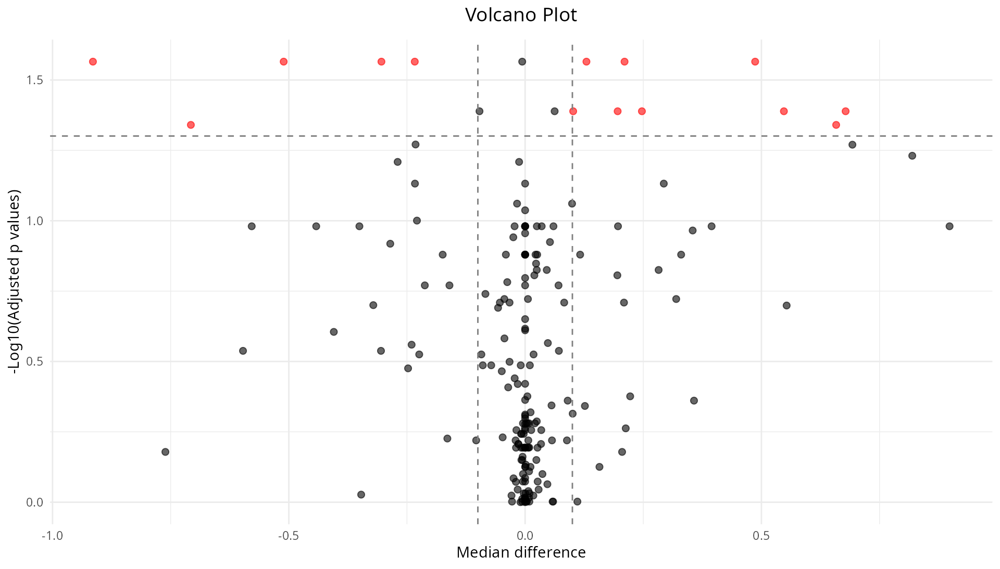

Now we will compare fold changes in two complementary ways: log fold
change of read counts and log fold change of Tsallis entropy values.

First, we visualize the fold changes computed directly from Tsallis
entropy values. These reflect changes in how evenly transcripts are
distributed within each gene, capturing isoform usage patterns
independently of overall abundance.

``` r

# Plot: Diversity-based fold changes
p_ma_tsallis <- plot_ma(res)
print(p_ma_tsallis)
```

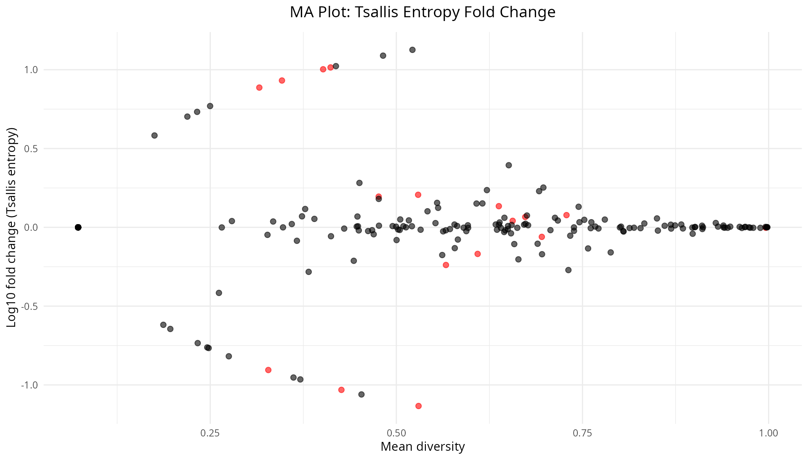

Before generating the second MA plot we need to compute and overlay read
count fold changes, which represent changes in total transcript
abundance aggregated at the gene level. It will be provided to the MA
plot, allowing us to compare diversity changes (isoform usage) with
abundance changes (total expression) for each gene.

``` r

# Compute read count fold changes with transcript collapsing
fc_rc <- calculate_fc_readcounts(
    readcounts = readcounts,
    genes = genes,
    samples = colData(ts_se)$sample_type,
    control = "Normal",
    agg_method = "mean",    # aggregate transcripts using mean
    fc_method = "mean"      # compute fold changes using mean
)

# Plot: Read count fold changes with diversity p-values
p_ma_readcounts <- plot_ma(res, fc_df = fc_rc)
print(p_ma_readcounts)
```

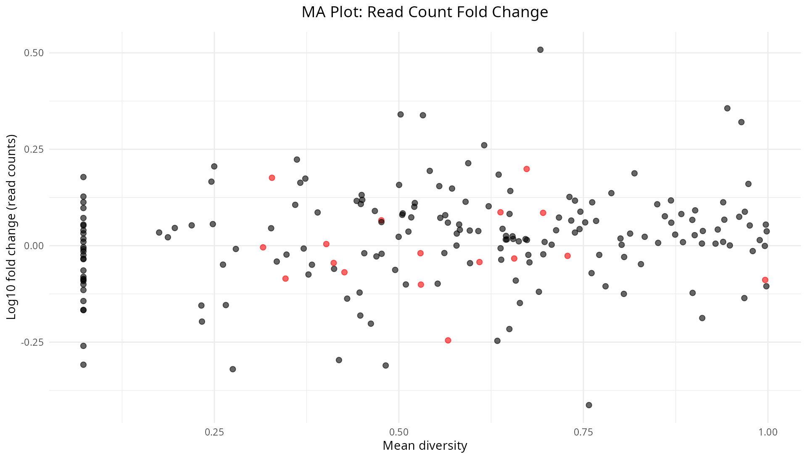

### Plot top 3 genes from the single-q differential analysis

Now will plot the top three genes by significance to inspect
isoform-level patterns that may explain the diversity differences.

First we will use the median as the aggregation method for plotting,
which provides a robust summary of the central tendency of
transcript-level expression across samples.

``` r

# Extract significant genes and prepare plotting data
prep <- extract_top_genes(res, ts_se, p_threshold = 0.05, top_n = 3)
top_genes <- prep$top_genes
samples_vec <- prep$samples_vec

# Plot using median aggregation
p_tx_median <- plot_top_transcripts(readcounts,
    gene = top_genes,
    samples = samples_vec, tx2gene = txmap,
    top_n = NULL, metric = "median"
)
print(p_tx_median)
```

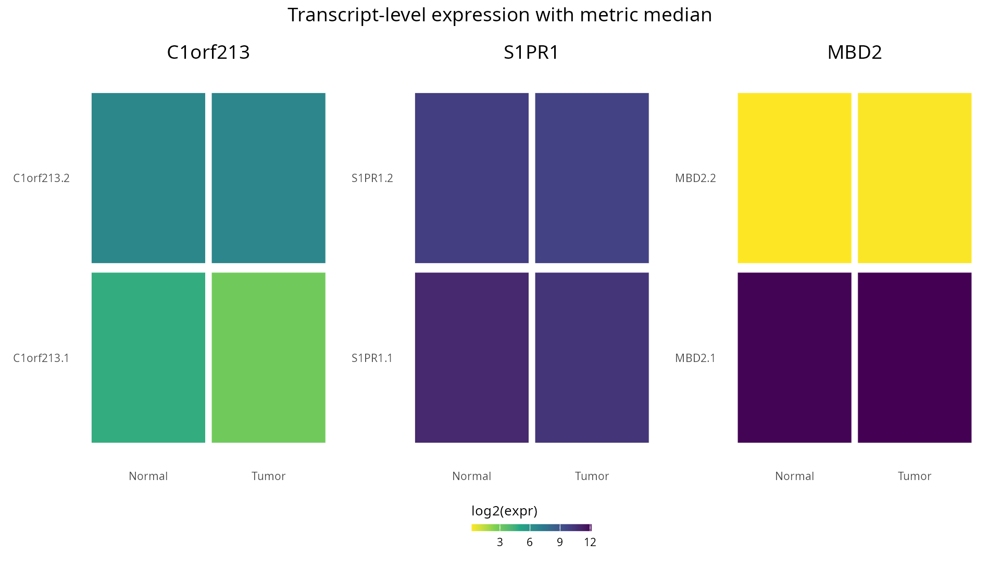

Next, we will plot the same top genes but using variance aggregation
instead of median. This allows us to see how transcript-level expression
variability differs between groups for these genes.

``` r

# Plot using variance aggregation
p_tx_variance <- plot_top_transcripts(readcounts,
    gene = top_genes,
    samples = samples_vec, tx2gene = txmap,
    top_n = NULL, metric = "variance"
)
print(p_tx_variance)
```

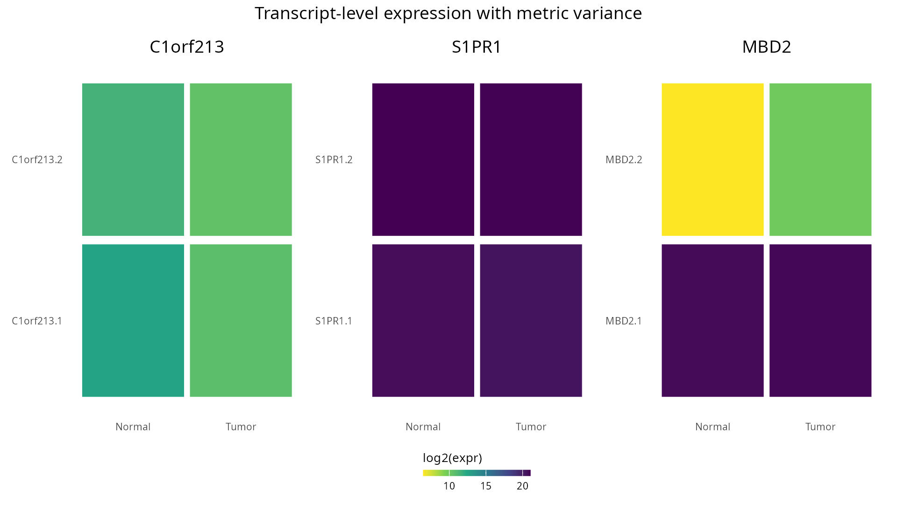

## Compare between q values

In the next section we are going to try a different approach. In instead
of evaluate the sificant estatistical differences by using single Thassi
`q` values, we will compute the normalized Tsallis entropy for two `q`
values (0.1 and 2) to studiy potential scale-dependent patterns (for
example, significance at `q = 0.1` but not at `q = 2` suggests
rare-isoform-driven changes).

``` r

# compute Tsallis entropy for q = 1 (normalized)
q <- c(0.1, 2)
ts_se <- calculate_diversity(readcounts, genes,
    q = q, norm = TRUE
)
head(assay(ts_se)[1:5, 1:5])
#>         TCGA-A7-A0CH_N_q=0.1 TCGA-A7-A0CH_N_q=2 TCGA-A7-A0CH_T_q=0.1
#> MXRA8              0.8616275          0.6063802            0.6609111
#> C1orf86            0.0000000          0.0000000            0.0000000
#> PDPN               0.2657489          0.6205367            0.2588286
#> ALDH4A1            0.8111864          0.7478309            0.4667361
#> HNRNPR             0.5204909          0.6176153            0.6683829
#>         TCGA-A7-A0CH_T_q=2 TCGA-A7-A0D9_N_q=0.1
#> MXRA8            0.3925463            0.8156972
#> C1orf86          0.0000000            0.0000000
#> PDPN             0.4729675            0.0000000
#> ALDH4A1          0.2841620            0.8621495
#> HNRNPR           0.6856195            0.7395887
```

Once again, before we proceed, we need to map the sample metadata into
the multi-q `SummarizedExperiment`.

``` r

ts_se <- map_coldata_to_se(ts_se, coldata_df)
```

In order to show the distributional differences between groups, we can
make use of **violin and density plots**.

``` r

p_violin <- plot_tsallis_violin_multq(ts_se, assay_name = "diversity")
print(p_violin)
```

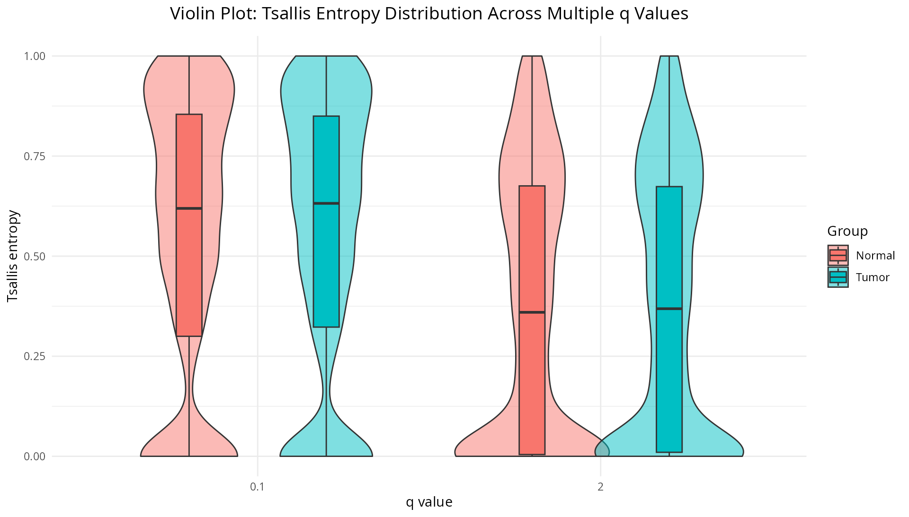

``` r

p_density <- plot_tsallis_density_multq(ts_se, assay_name = "diversity")
print(p_density)
```

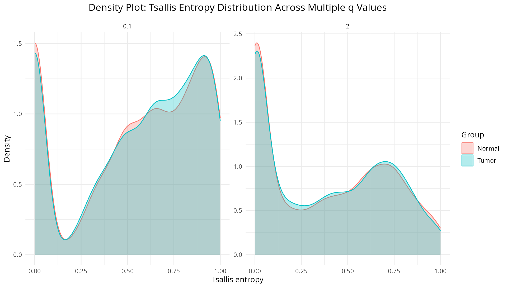

## Linear-model interaction and shape tests for q-curves

Finally, we will compute normalized Tsallis entropy across a sequence of
`q` values.

``` r

# compute Tsallis entropy for a sequence of values (normalized)
qvec <- seq(0.01, 2, by = 0.1)
ts_se <- calculate_diversity(readcounts, genes,
    q = qvec, norm = TRUE
)
head(assay(ts_se)[1:5, 1:5])
#>         TCGA-A7-A0CH_N_q=0.01 TCGA-A7-A0CH_N_q=0.11 TCGA-A7-A0CH_N_q=0.21
#> MXRA8               0.9840684             0.8500785             0.7527194
#> C1orf86             0.0000000             0.0000000             0.0000000
#> PDPN                0.2515488             0.2673553             0.2837239
#> ALDH4A1             0.9759153             0.7976183             0.6982381
#> HNRNPR              0.5653272             0.5164881             0.4849368
#>         TCGA-A7-A0CH_N_q=0.31 TCGA-A7-A0CH_N_q=0.41
#> MXRA8               0.6818220             0.6303117
#> C1orf86             0.0000000             0.0000000
#> PDPN                0.3006258             0.3180269
#> ALDH4A1             0.6447807             0.6181672
#> HNRNPR              0.4655343             0.4548022
```

Map once again the sample metadata into the multi-q
`SummarizedExperiment` as before.

``` r

# For paired designs ensure sample_base is created so LMMs can use it
ts_se <- map_coldata_to_se(ts_se, coldata_df, paired = TRUE)
```

Once we have the `q-sequence` computed, we can test for interactions
between `q` and sample groups using different statistical approaches. A
practical default for paired RNA-seq designs is to use **Linear Mixed
Mdels (LMMs)**; in addition, in this analysis we will use the
**Satterthwaite approximation** for stimating the p-values, since it
proviedes more accuracy in small-to-moderate paired samples.

For specific use cases, other approaches are available:

- **Generalized additive models (GAMs):** use when the relationship
  between `q` and group differences is expected to be nonlinear or
  smooth. GAMs can flexibly model complex q-curve shapes.

- **Functional-data approaches (FPCA, functional regression):** treat
  each gene’s q-curve as a functional object to detect changes in curve
  shape (global pattern differences rather than per-q effects).

- **Permutation / label-shuffle tests:** use when sample sizes are very
  small, when exchangeability is plausible, or when distributional
  assumptions are dubious.

Additional information about the implemented LMM-based interaction test
can be found in this [paper](https://doi.org/10.18637/jss.v067.i01).

``` r

# Linear-model interaction test across q values: detect q x group interaction
# Compute and show top hits (by adjusted p-value)
lm_res <- calculate_lm_interaction(ts_se,
        sample_type_col = "sample_type", method = "lmm",
        pvalue = "satterthwaite",
        subject_col = "sample_base",
        nthreads = 1,
        verbose = FALSE)
#> Warning in vcov.merMod(object, use.hessian = use.hessian): Computed variance-covariance matrix problem: not a positive definite matrix (and positive semidefiniteness is not checked);
#> returning NA matrix
print(head(lm_res, 3))
#>     gene p_interaction        p_lrt p_satterthwaite estimate_interaction
#> 1 HAPLN3  1.858060e-50 1.729070e-50    1.858060e-50           -0.1545816
#> 2 COL1A2  6.454700e-47 6.037249e-47    6.454700e-47           -0.1787682
#> 3   PI16  2.694297e-42 2.536901e-42    2.694297e-42            0.1252628
#>   adj_p_interaction
#> 1      3.697539e-48
#> 2      6.422426e-45
#> 3      1.787217e-40
```

#### Visualizing interaction results: diagnostic plots and top transcripts

Once we have the interaction results, we can visualize the genes with
higher significant according the LLM interaction test.

``` r

# Plot transcript-level expression for top 3 genes by interaction significance
sig_res <- lm_res[lm_res$adj_p_interaction < 0.05, , drop = FALSE]
top_genes <- head(sig_res$gene, 3)
samples_vec <- as.character(coldata_df$Condition[1:ncol(readcounts)])

# Plot using median aggregation
p_lm_median <- plot_top_transcripts(readcounts,
    gene = top_genes,
    samples = samples_vec,
    tx2gene = txmap,
    top_n = NULL,
    metric = "median"
)
print(p_lm_median)
```

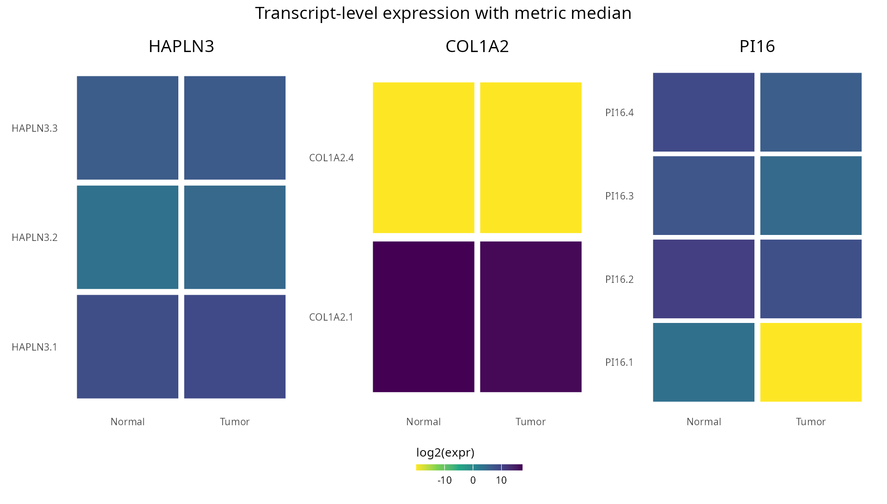

``` r

# Also show variance-based aggregation
p_lm_variance <- plot_top_transcripts(readcounts,
    gene = top_genes,
    samples = samples_vec,
    tx2gene = txmap,
    top_n = NULL,
    metric = "variance"
)
print(p_lm_variance)
```

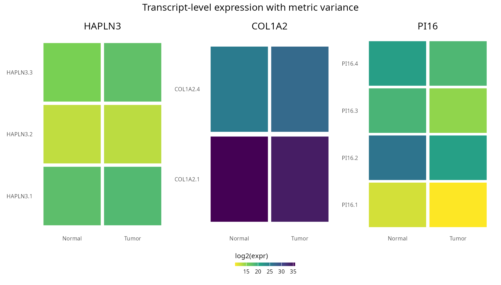

### Tsallis q-sequence plot

With the **Tsallis q-sequence** we can also produce a q-curve per sample
and gene. Diverging curves between groups indicate **scale-dependent
diversity differences**: separation at low `q` implies differences in
rare isoforms, while separation at high `q` signals differences in
dominant isoforms.

First we will plot the q-curve profile for the top gene identified by
the linear-model interaction test. We will start with `HAPLN3`.

``` r

# Plot q-curve profile for top linear-model gene
plot_target <- plot_tsallis_gene_profile(ts_se, gene = "HAPLN3")
print(plot_target)
```

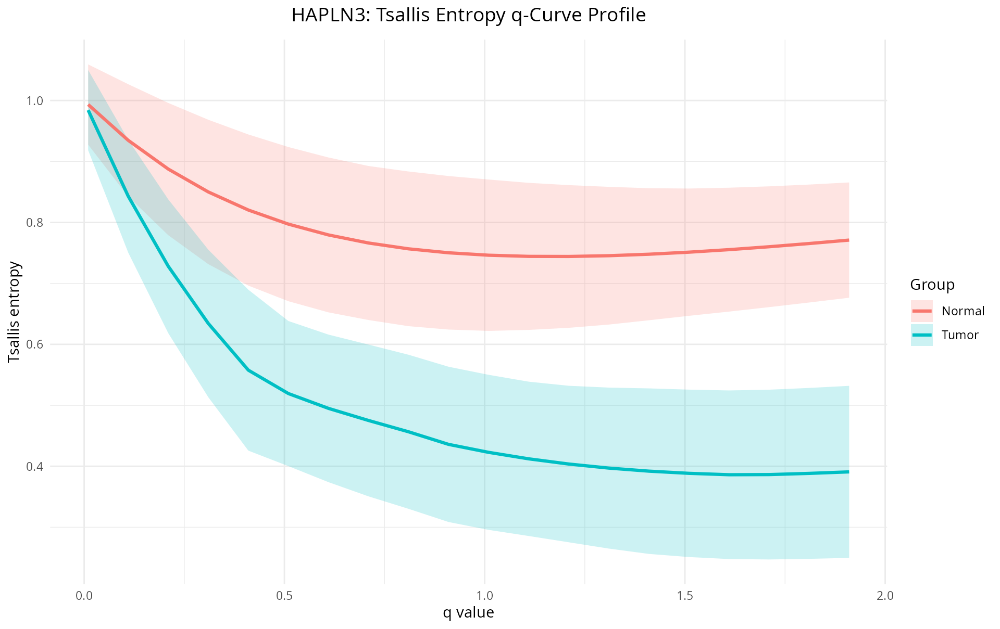

Now we will look at `COL1A2`.

``` r

# Plot q-curve profile for top linear-model gene
plot_target <- plot_tsallis_gene_profile(ts_se, gene = "COL1A2")
print(plot_target)
```

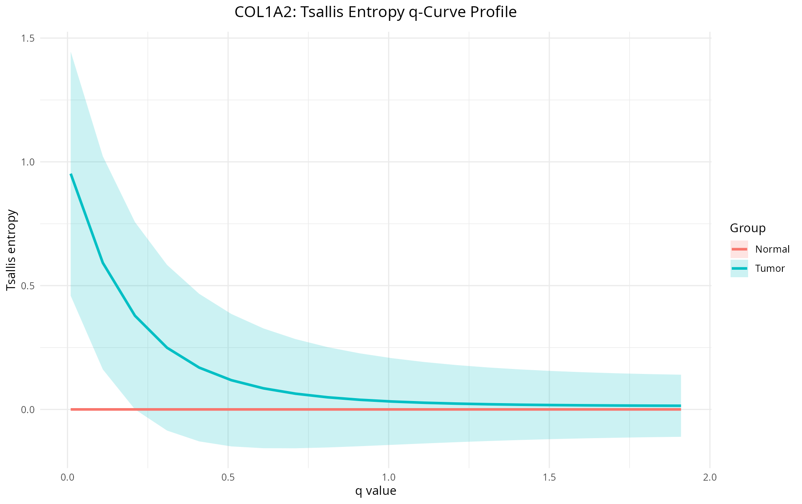

Finally, we can visualize the gene `PI16`.

``` r

# Plot q-curve profile for top linear-model gene
plot_target <- plot_tsallis_gene_profile(ts_se, gene = "PI16")
print(plot_target)
```

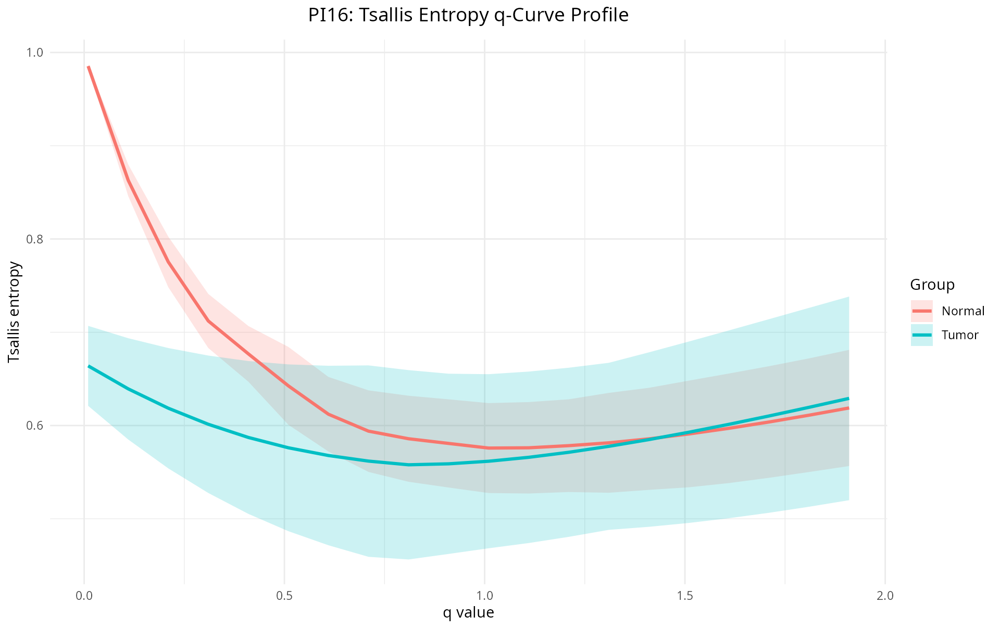

We can also plot the **overall Tsallis q-curve for all genes**. This
plot provides a global view of how diversity changes across the `q`
spectrum for the entire dataset and can reveal general trends in isoform
diversity.

``` r

# Plot top tsallis q curve
p_qcurve <- plot_tsallis_q_curve(ts_se) +
    ggtitle("Global Tsallis q-Curve: Entropy Across All Genes") +
    theme(plot.title = element_text(hjust = 0.5, size = 14,
                                     margin = margin(b = 10)))
print(p_qcurve)
```

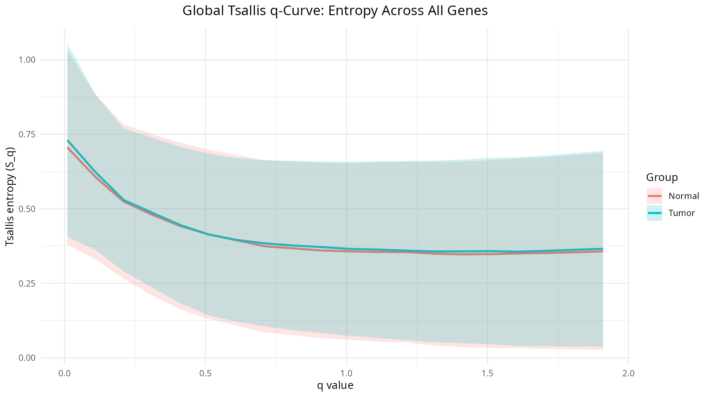

## Practical notes and recommendations

Some important elements to keep in mind:

- **Quantification & normalization**: Use bias-aware quantifiers such as
  Salmon or kallisto.
- **Transcript abundance filtering**: remove very low-count transcripts
  to reduce technical noise (typical rule: drop transcripts with \<5
  reads in \>5 samples, but adjust to sequencing depth).
- **Pseudocounts**: if zeros create numerical issues, you could add a
  small pseudocount (e.g., 1e-10). You can find more information about
  pseudocounts in this
  [paper](https://doi.org/10.1093/bioinformatics/bty471).

``` r

sessionInfo()
#> R version 4.5.2 (2025-10-31)
#> Platform: x86_64-conda-linux-gnu
#> Running under: Ubuntu 22.04.5 LTS
#> 
#> Matrix products: default
#> BLAS/LAPACK: /home/nouser/miniconda3/lib/libopenblasp-r0.3.30.so;  LAPACK version 3.12.0
#> 
#> locale:
#>  [1] LC_CTYPE=es_ES.UTF-8       LC_NUMERIC=C              
#>  [3] LC_TIME=de_DE.UTF-8        LC_COLLATE=es_ES.UTF-8    
#>  [5] LC_MONETARY=de_DE.UTF-8    LC_MESSAGES=es_ES.UTF-8   
#>  [7] LC_PAPER=de_DE.UTF-8       LC_NAME=C                 
#>  [9] LC_ADDRESS=C               LC_TELEPHONE=C            
#> [11] LC_MEASUREMENT=de_DE.UTF-8 LC_IDENTIFICATION=C       
#> 
#> time zone: Europe/Berlin
#> tzcode source: system (glibc)
#> 
#> attached base packages:
#> [1] stats4    stats     graphics  grDevices utils     datasets  methods  
#> [8] base     
#> 
#> other attached packages:
#>  [1] mgcv_1.9-4                  nlme_3.1-168               
#>  [3] SummarizedExperiment_1.40.0 Biobase_2.70.0             
#>  [5] GenomicRanges_1.62.1        Seqinfo_1.0.0              
#>  [7] IRanges_2.44.0              S4Vectors_0.48.0           
#>  [9] BiocGenerics_0.56.0         generics_0.1.4             
#> [11] MatrixGenerics_1.22.0       matrixStats_1.5.0          
#> [13] ggplot2_4.0.2               TSENAT_0.99.0              
#> 
#> loaded via a namespace (and not attached):
#>  [1] gtable_0.3.6        xfun_0.56           bslib_0.10.0       
#>  [4] htmlwidgets_1.6.4   lattice_0.22-7      numDeriv_2016.8-1.1
#>  [7] Rdpack_2.6.5        vctrs_0.7.1         tools_4.5.2        
#> [10] tibble_3.3.1        pkgconfig_2.0.3     Matrix_1.7-4       
#> [13] RColorBrewer_1.1-3  S7_0.2.1            desc_1.4.3         
#> [16] lifecycle_1.0.5     compiler_4.5.2      farver_2.1.2       
#> [19] textshaping_1.0.4   lmerTest_3.2-0      htmltools_0.5.9    
#> [22] sass_0.4.10         yaml_2.3.12         nloptr_2.2.1       
#> [25] pkgdown_2.2.0       pillar_1.11.1       jquerylib_0.1.4    
#> [28] tidyr_1.3.2         MASS_7.3-65         DelayedArray_0.36.0
#> [31] cachem_1.1.0        reformulas_0.4.4    boot_1.3-32        
#> [34] abind_1.4-8         tidyselect_1.2.1    digest_0.6.39      
#> [37] dplyr_1.1.4         purrr_1.2.1         labeling_0.4.3     
#> [40] splines_4.5.2       fastmap_1.2.0       grid_4.5.2         
#> [43] cli_3.6.5           SparseArray_1.10.8  magrittr_2.0.4     
#> [46] patchwork_1.3.2     S4Arrays_1.10.1     withr_3.0.2        
#> [49] scales_1.4.0        rmarkdown_2.30      XVector_0.50.0     
#> [52] lme4_1.1-38         otel_0.2.0          ragg_1.5.0         
#> [55] evaluate_1.0.5      knitr_1.51          rbibutils_2.4.1    
#> [58] viridisLite_0.4.3   rlang_1.1.7         Rcpp_1.1.1         
#> [61] glue_1.8.0          minqa_1.2.8         jsonlite_2.0.0     
#> [64] R6_2.6.1            systemfonts_1.3.1   fs_1.6.6
```
