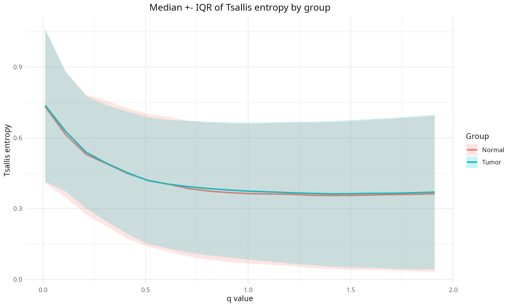

# TSENAT: Tsallis Entropy Analysis Toolbox

TSENAT analyze expression/transcript differences and compute diversity
metrics.

## Origin and attribution

TSENAT builds upon and adapts substantial portions of code from the
[SplicingFactory package](https://github.com/esebesty/SplicingFactory).
The codebase has been extended with additional utilities, bug fixes and
plotting helpers focused on Tsallis based transcript-level diversity
analysis.

## Tsallis theory

Tsallis entropy generalizes Shannon entropy and is defined as S_q = (1 -
sum p^q) / (q - 1) for a probability vector p. In the limit q -\> 1 it
recovers Shannon entropy. In TSENAT we compute Tsallis entropy and the
related Hill numbers (D_q) per gene to measure isoform diversity. The
parameter `q` tunes sensitivity to rare vs abundant isoforms (q \< 1
emphasizes rare isoforms; q \> 1 emphasizes abundant ones).

## Integrated features

- Tsallis entropy and diversity calculations:
  - `calculate_tsallis_entropy`: computes S_q and/or D_q for a numeric
    vector of expression values (supports normalization, multiple `q`
    values and the q→1 limit). Returns numeric vectors or a list
    depending on `what`.
  - `calculate_diversity`: applies the calculation across
    transcripts/genes for matrices, `tximport`-style lists or
    `SummarizedExperiment` objects and returns a `SummarizedExperiment`
    with assay `diversity` (S_q) or `hill` (D_q).
- Differential and statistical analyses:
  - `calculate_difference` and helpers in `difference_functions` compute
    group means, differences (or log2 fold-changes), p-values and
    adjusted p-values. These functions are designed to work with
    diversity summaries as well as expression matrices.
- Plotting and visualization:
  - `plot_tsallis_q_curve`: median ± IQR of Tsallis entropy across
    q-values by group.

## Installation and documentation

Install from GitHub during development:

``` r

if (!requireNamespace("remotes", quietly = TRUE)) install.packages("remotes")
remotes::install_github("gallardoalba/TSENAT")

## Recommended (reproducible): use `renv`.

install.packages("renv")
renv::init()
# when dependencies are set, record lock
renv::snapshot()
```

## Quick start

Compute Tsallis diversity for a single `q` and plot a q-curve across
multiple `q` values (small, focused example taken from the vignette):

``` r

library(TSENAT)
data("tcga_brca_luma_dataset", package = "TSENAT")

# compute for q = 0.1 and normalize
readcounts <- tcga_brca_luma_dataset$counts
genes <- tcga_brca_luma_dataset$gene
ts_se <- calculate_diversity(readcounts, genes, method = "tsallis", q = 0.1, norm = TRUE)

# compute for multiple q values and plot the q-curve
qs <- c(0.1, 0.5, 1, 2)
ts_multi <- calculate_diversity(readcounts, genes, method = "tsallis", q = qs, norm = TRUE)
plot_tsallis_q_curve(ts_multi, group = colData(ts_multi)$sample_type)
```



q-curve example

The complete documentation can be found at
[inst/doc/TSENAT.html](https://gallardoalba.github.io/TSENAT/inst/doc/TSENAT.md).

## Citation and license

This project is licensed under the GNU General Public License v3.0
(GPL-3). A copy of the full license text is included in the repository
at `LICENSE` and is installed with the package under `inst/LICENSE`.

See `citation("TSENAT")` or
[inst/CITATION](https://gallardoalba.github.io/TSENAT/inst/CITATION).
License in [LICENSE](https://gallardoalba.github.io/TSENAT/LICENSE).
